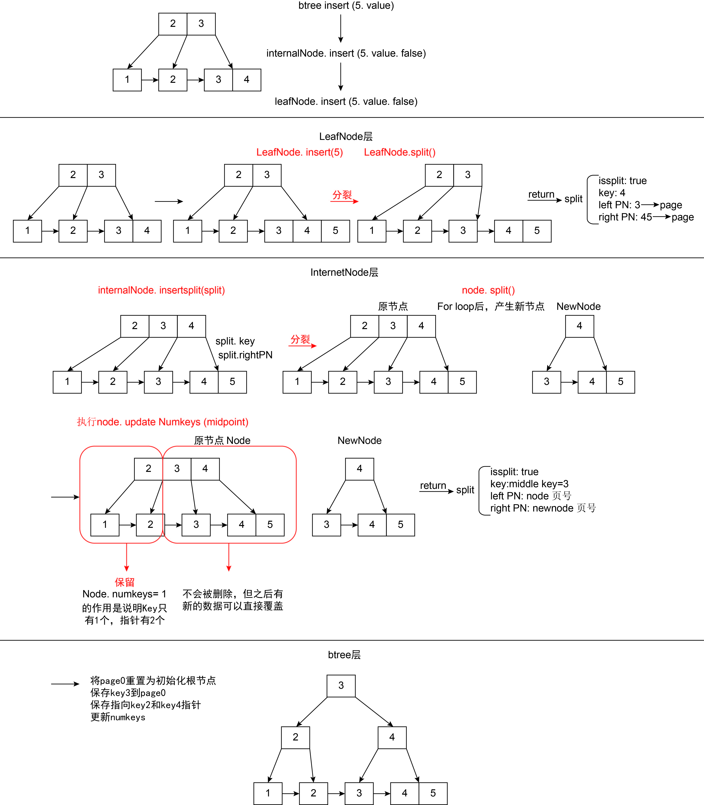

# B+ Tree

# 1. Important Concepts

## **1.1 Explanation of B+ Tree degree (degree) of 202 in this project:**

- Each non-leaf node can have at most 201 key indexes and 202 child nodes (pages), each leaf node can store at most 201 key-value pairs, calculation rules are in Section 3.2
- Each non-leaf node (internal node) has at least ⌈203/2⌉ child nodes
- The root node has at least two child nodes, unless it is a leaf node
- An internal node with k child nodes contains k-1 keys

A complete example of a B+ tree with degree 3:

```
             [10,  20]           <- Internal Node (root node)   <---  
          /      |     \                                        <---
     [5,7]    [15,17]  [25,30]   <- Internal Nodes              <---            
    /  |  \    /  |  \   /  |  \                                <--- BTreeIndex
   L1  L2  L3  L4  L5 L6 L7  L8 L9  <- Leaf Nodes (store actual data) <---
   |   |   |   |   |   |  |   |   |                             <---
   ------>----->----->--->--->---->  <- Leaf node linked list (singly linked) <---
```

## 1.2 B+ Tree Capacity Calculation

- In a B+ tree, assuming the degree is x and the tree height is n layers (root node is the 1st layer), we can calculate the maximum number of key-value pairs this tree can store. For a B+ tree:

  - Each internal node can have at most x child node pointers and x-1 keys

  - Each leaf node can store at most x-1 key-value pairs

  - All leaf nodes are at the same layer (the nth layer)

- Formula for the maximum total number of key-value pairs the entire B+ tree can store:

%20\cdot%20x^{n-1})

- For example, when degree=202:

  - Two-layer B+ tree: 201 × 202 = 40,602 key-value pairs

  - Three-layer B+ tree: 201 × 202² = 8,201,604 key-value pairs

## 1.3 Important Helper Functions

### 1.3.1 getKeyAt

- After inputting the index, since each key_size is the same, we can get the data by slicing the data
- Similar functions for reading and modifying page data are all through this slicing method

```go
[KEYS_OFFSET(11bytes)][KEY(10bytes)][KEY2(10bytes)]...
                      |<-- slice -->|
                      11           21
// getKeyAt gets the stored key value from the specified index position of the internal node
// Concurrency note: The page of the InternalNode needs at least a read lock before calling this function
func (node *InternalNode) getKeyAt(index int64) int64 {
	// 1. Calculate the starting position of the key in the page
	// Use the keyPos function to calculate the offset of the index-th key
	// startPos = KEYS_OFFSET + index*KEY_SIZE
	startPos := keyPos(index)

	// 2. Read and decode the key value from the page data
	// - node.page.GetData() gets the byte data of the entire page
	// - [startPos : startPos+KEY_SIZE] extracts the byte segment of the key
	// - binary.Varint decodes the byte sequence into an int64 type key value
	key, _ := binary.Varint(node.page.GetData()[startPos : startPos+KEY_SIZE])

	// 3. Return the decoded key value
	return key
}
```

# 2. B+ Tree Index

## 2.1 Related Structure Definitions

### 2.1.1 BTreeIndex Structure

```go
// Index interface defines standard operation methods for database indexes
type Index interface {
    // Close closes the index and releases resources
    Close() error
    // GetName returns the name of the index
    GetName() string
    // GetPager returns the page manager used by the index
    GetPager() *pager.Pager
    // Find finds the entry for the specified key
    Find(int64) (entry.Entry, error)
    // Insert inserts a new key-value pair into the index
    Insert(int64, int64) error
    // Update updates the value of an existing key in the index
    Update(int64, int64) error
    // Delete deletes the entry for the specified key from the index
    Delete(int64) error
    // Select returns all entries in the index
    Select() ([]entry.Entry, error)
    // Print prints the entire index structure
    Print(io.Writer)
    // PrintPN prints the contents of a specific page number node
    PrintPN(int, io.Writer)
    // CursorAtStart returns a cursor pointing to the first entry in the index
    CursorAtStart() (cursor.Cursor, error)
}

// BTreeIndex implements the Index interface, using a B+ tree as the underlying data structure
type BTreeIndex struct {
    pager  *pager.Pager // Page manager that stores B+ tree data
    rootPN int64        // Page number of the B+ tree root node
}

// Close closes the index and flushes all changes to disk
func (index *BTreeIndex) Close() error { ... }
// GetName returns the file name of the index
func (index *BTreeIndex) GetName() string { ... }
// GetPager returns the index's page manager
func (index *BTreeIndex) GetPager() *pager.Pager { ... }
// Find finds the entry for the specified key in the B+ tree
func (index *BTreeIndex) Find(key int64) (entry.Entry, error) { ... }
// Insert inserts a new key-value pair into the B+ tree, handling possible node splits
func (index *BTreeIndex) Insert(key int64, value int64) error { ... }
// Update updates the value of an existing key in the B+ tree
func (index *BTreeIndex) Update(key int64, value int64) error { ... }
// Delete deletes the entry for the specified key from the B+ tree
func (index *BTreeIndex) Delete(key int64) error { ... }
// Select returns all entries in the B+ tree, sorted by key
func (index *BTreeIndex) Select() ([]entry.Entry, error) { ... }
// Print formats and prints the entire B+ tree structure
func (index *BTreeIndex) Print(w io.Writer) { ... }
// PrintPN formats and prints the contents of a node with the specified page number
func (index *BTreeIndex) PrintPN(pagenum int, w io.Writer) { ... }
// CursorAtStart returns a cursor pointing to the first entry in the leftmost leaf node of the B+ tree
func (index *BTreeIndex) CursorAtStart() (cursor.Cursor, error) { ... }
```

- Contains a page manager and initialized root Page Number = 0.

- Here BTreeIndex is an implementation of the Index interface. BtreeIndex implements all methods of the Index interface. In Go, as long as a type implements all methods defined by an interface, it implicitly automatically implements that interface, and doesn't need to care about which parameter attributes the implementing class has.

- Java: Explicitly implements interfaces with the implements keyword, the implementing class implements all interface methods, different implementing classes can have different parameters.

- Go: Implicitly implements interfaces, the implementing class implements all interface methods, different implementing classes can have different parameters.

### 2.1.2 Split Structure

```go
type Split struct {
    isSplit bool  // Flag indicating whether a split occurred
    key     int64 // Middle key that needs to be promoted to the parent node
    leftPN  int64 // Page number of the left child node
    rightPN int64 // Page number of the right child node
}
```

- The Split structure is used to pass split information upward when a node splits. When a node splits, it returns a Split structure containing a separator key and the page numbers of two child nodes, for the parent node to handle the split and update pointer relationships. This design implements the bottom-up splitting mechanism of B+ trees, ensuring the tree structure always remains balanced.

### 2.1.2 Node Interface

```go
// Node defines a common interface shared by leaf nodes and internal nodes
type Node interface {
    // insert inserts or updates a key-value pair in the B+ tree, may trigger node splitting
    insert(key int64, value int64, update bool) (Split, error)
    // delete deletes the entry for the specified key from the B+ tree
    delete(key int64)
    // get finds and returns the value and existence status for the specified key
    get(key int64) (value int64, found bool)
    // search binary searches for the position index of the specified key in the node
    search(searchKey int64) int64
    // printNode formats and outputs the node contents to the specified output stream
    printNode(io.Writer, string, string)
    // getPage returns the underlying page for the node
    getPage() *pager.Page
    // getNodeType returns the node type (internal node or leaf node)
    getNodeType() NodeType
}
```

- The Node interface defines basic operations shared by internal nodes and leaf nodes, and is implemented by the InternalNode and LeafNode structures, supporting Go's polymorphism feature.

## 2.2 BtreeIndex Functions

### 2.2.1 Insert

```go
func (index *BTreeIndex) Insert(key int64, value int64)
```

#### A. Parameter Introduction

- Parameters:
  - key - The key to insert
  - value - The value to insert
- Returns: err - Possible errors include: inserting duplicate keys, page allocation failure, root node split exception, etc., returns nil on successful insertion
- Purpose: Insert an entry key-value pair into the B+ tree index

Using inserting key5 as an example, initial structure:

               [key2,key3]
              /     |     \
        [key1]->[key2]->[key3,key4]

#### **B. Call Chain of the Insertion Process**

1. `BTreeIndex.Insert(5)`
2. -> `InternalNode[key2,key3].insert(5)`
3. -> `LeafNode[key3,key4].insert(5)`

#### **C. Complete Flow**  

1. Get and lock the root node:

   - Get the root page: `rootPage, err := index.pager.GetPage(index.rootPN)`

   - Lock the root page: `lockRoot(rootPage)`

   - Convert the root page to a node: `rootNode := pageToNode(rootPage)`

   - Initialize the root node: `initRootNode(rootNode)` sets the parent node pointer

   - Set deferred release: `defer index.pager.PutPage(rootPage)`

   - Set deferred unlock: `defer unsafeUnlockRoot(rootNode)` ensures the root node is unlocked when the function returns, not normally called

   - Purpose: Ensure the root page is released when the function ends, preventing memory leaks

2. Leaf node insertion and splitting

   - Call chain: `LeafNode[key3,key4].insert(5) -> node.split()`
   
   
      - Split result: `Split{key:key4, leftPN:key3's page, rightPN:key4's page}`, **here the returned Split information is the new separator key and pointers (child node page numbers) to be inserted into the parent internal node**
   


```
Leaf layer split: [key3,key4] -> [key3,key4,key5] -> [key3] | [key4,key5]

After splitting:
           [key2,key3]
          /     |     \
    [key1]->[key2]->[key3]->[key4,key5]   
```

3. Internal node handles splitting

   - Receive separator key and pointer information from the leaf node: `Split{key:key4, leftPN:key3's page, rightPN:key4's page}`
   
   
      - Call chain: `InternalNode[key2,key3].insertSplit(Split{key:key4, leftPN:key3's page, rightPN:key4's page})`
   
   - - **Insert key4 in [key2,key3], insert the pointer pointing to the leaf node split information's rightPN (child node page number)**
   
     - Internal node becomes [key2,key3,key4]
   
       ```
             [ key2  key3   key4 ]   
             /     |      |      \
       [key1]->[key2]->[key3]->[key4,key5]   
       ```
   
     - Because it exceeds the maximum capacity of the node (maximum 2 keys when degree=3), it needs to split

4. Internal node splitting (see diagram)

   - Call chain: `InternalNode.split()`
   
   
      - Split process:
   
        a. Calculate the split point
   
        - `midpoint = (3-1)/2 = 1`, i.e., the position of key3
   
        b. Create a new node and transfer data, the new node
   
        ```
            [key4]
           /      \
        [key3]->[key4 key5]
        ```
   
        c. Process original node data
   
        - Execute `node.updateNumKeys(midpoint)`, set the number of keys to 1
        - Data characteristics:
          - The actual data in the page is still `[key2,key3,key4]`
          - Because numKeys=1, only key2 can be accessed
          - key3, key4 and the nodes they point to physically exist but are logically inaccessible
          - These "invisible" data areas will be overwritten by new data in the future
        
        d. Split result:
        
        - `Split{key:key3, leftPN: original node page, rightPN: new node's page}`, here the returned Split information is the key and pointers (child node page numbers) for the new upper layer node
   
5. Assemble the new root node

   - Because it's a root node split, a new root node needs to be created
   - Special handling: The root node must remain on page 0
   - page 0 saves key3 to page0
   - Save pointers to key2's page and key4's page
   - Update numKeys
   - Final tree assembly completed 👇

                  	      ```
                                            [key3]         (page 0)
                                  	     /       \
                                  	[key2]        [key4]    (other pages)
                            	        /    \       /      \
                                [key1]->[key2]->[key3]->[key4,key5]
                ```

   ​         

6. Diagram



### 2.2.2 Select

```go
func (index *BTreeIndex) Select() ([]entry.Entry, error)
```

#### **A. Parameter Introduction**

- Parameters: None
- Returns:
  - []entry.Entry - A slice containing all entries in the B+ tree, sorted by key
  - error - Possible errors, such as failure to get cursor, failure to read entries, etc.
- Purpose: Return all entries in the B+ tree, sorted by key order

Using traversing the entire tree as an example, initial structure:

```
          [key3]         (page 0)
          /     \
      [key2]   [key4]    (other pages)
      /    \    /    \
[key1]->[key2]->[key3]->[key4,key5]
```

#### **B. Call Chain of the Traversal Process**

1. `BTreeIndex.Select()`
2. -> `BTreeIndex.CursorAtStart()`
3. -> `BTreeCursor.GetEntry()` + `BTreeCursor.Next()` loop

#### **C. Complete Flow**

1. Get a cursor at the starting position 
   - Call chain: `CursorAtStart() -> Traverse from root to left -> Reach the leftmost leaf node`
   - Call `cursor.Close()` to ensure that the locks held by the cursor are released when the function ends

```
         [key3]         
          /               Start from root
      [key2]              Traverse to the left      
      /     
[key1]->                  Reach the leftmost leaf
```

2. Traverse all leaf node data

   - Create a dynamic slice entries to store the results

   - Loop processing:

     - `cursor.GetEntry()` gets the current entry
     - Add to the result set `entries = append(entries, entry)`
     - `cursor.Next()` moves to the next entry. Here there is movement within a node or between nodes. Moving within a node only requires incrementing curIndex. Moving between nodes is done by finding the next node through the right neighbor page number and initializing the position of the new starting point. 


3. Return result
   - The final result is the dynamic slice entries, containing all key-value pairs from leaf nodes


### 2.2.3 SelectRange

```go
func (index *BTreeIndex) SelectRange(startKey int64, endKey int64) ([]entry.Entry, error)
```

#### **A. Parameter Introduction**

- Parameters:
  - startKey - Starting key of the range (inclusive)
  - endKey - Ending key of the range (exclusive)
- Returns:
  - []entry.Entry - A slice containing all entries with keys in the range [startKey, endKey)
  - error - Possible errors, including invalid parameters (startKey >= endKey), failure to get cursor, failure to read entries, etc.
- Purpose: Query all entries within a specific key range, the range is [startKey, endKey)

Using traversing to find startKey = key2, endKey = key4 as an example, initial structure:

```
           [key3]         (page 0)
          /     \
      [key2]   [key4]    (other pages)
      /    \    /    \
[key1]->[key2]->[key3]->[key4,key5]
```

#### **B. Call Chain of the Traversal Process**

1. `BTreeIndex.SelectRange()`

2. -> `BTreeIndex.CursorAt(startKey)`

3. -> `BTreeCursor.GetEntry()` + `BTreeCursor.Next()` loop

#### **C. Complete Flow**

1. Parameter validation and initialization

   - Check the range validity: startKey < endKey

   - Create a dynamic slice to store the result set


2. Locate the starting position 
   - Call chain: `c = CursorAt(startKey) -> Search from root downward -> Locate to startKey`, let cursor `c` point to the startKey position
   - Call `c.Close()` to ensure that the locks held by the cursor are released when the function ends

```
         [key3]
          /
     [key2]
     /    \
[key1]->[key2]  <-   Cursor points to Key2
```

3. Traverse and collect range data 

   - Loop processing until endKey or the end of the B+ tree is encountered:

     - `cursor.GetEntry()` gets the current entry
     - Check if the range end has been reached (endKey > checkEntry.Key)
     - If the end hasn't been reached:
     
       - Add to the result set
     
       - `cursor.Next()` move to the next position


4. Return result
   - The final result is similar to Select, a dynamic slice containing entries within the specific range


### 2.2.4 Find

```go
func (index *BTreeIndex) Find(key int64) (entry.Entry, error)
```

#### **A. Parameter Introduction**

- Parameters:
  - key - The key to find
- Returns:
  - entry.Entry - The found entry, containing the key and associated value
  - error - Returns "no entry with key %d was found" error if the key doesn't exist, or possible page acquisition failure error
- Purpose: Find the entry for a specified key in the B+ tree

Using finding key4 as an example, initial structure:

```
           [key3]         (page 0)
          /     \
      [key2]   [key4]    (other pages)
      /    \    /    \
[key1]->[key2]->[key3]->[key4,key5]
```

#### **B. Call Chain of the Search Process**

1. `BTreeIndex.Find()`
2. -> `Node.get()` (Interface polymorphism, the actual method executed is the `get` method of an internal node or leaf node)
3. -> Recursive call until a leaf node

#### **C. Complete Flow** 

1. Get and lock the root page, convert it to a root node, set delayed release of the root node's lock and page release


2. Start searching from the root node
   - `rootNode.get(key)` interface polymorphism executes the `get` method of an internal node or leaf node.


```
       [key3]         
          \               key4 > key3
      --->  [key4]        Search towards the right subtree      
            /     
        [key3]->[key4,key5]   Find the target leaf node
```

3. Locate in an internal node

   - `node.search(key)`, binary search to locate the position, use binary search to find the position `childIndex` of the first key greater than key

   - Call `getAndLockChildAt(childindex)`
     - Get the page number of the child node through childIndex, then get the page from the page manager
     - Convert the page to a child node
   
   
      - Recursively call `child.get(key)` again, until reaching a leaf node
   


4. Locate in a leaf node 

   - `node.search(key)`, binary search to locate the position, locate the position of the key
   
   
      - `node.getEntry(index)` gets the entry
   


5. Return result

   - Found: Return the corresponding Entry
   
   
      - Not found: Return error "no entry with key %d was found"
   


### 2.2.5 Update

```go
func (index *BTreeIndex) Update(key int64, value int64) error
```

#### **A. Parameter Introduction**

- Parameters:
  - key - The key to update
  - value - The new value to set
- Returns:
  - error - Returns "cannot update non-existent entry" error if the key doesn't exist, or possible page acquisition/update failure error; returns nil on successful update
- Purpose: Update the value of a specified key in the B+ tree, without changing the tree structure

#### **B. Call Chain of the Update Process**

1. `BTreeIndex.Update()`
2. -> `Node.insert(key, value, update=true)` (Reuse the `insert` method, but set the update flag to true)
3. -> Recursive call until a leaf node

#### C. Complete Flow

1. Get and lock the root page, convert it to a root node, set delayed release of the root node's lock and page release

2. Directly call `Node.insert(key, value, update=true)`

3. Only modify the value, don't change the tree structure

4. Update data on the page

5. Return result

   - Update successful: Return nil


   - Key doesn't exist: Return error "cannot update non-existent entry"

### 2.2.6 Delete

#### **A. Parameter Introduction**

- Parameters:
  - key - The key to delete
- Returns:
  - error - Returns error information if page acquisition fails during the deletion process, returns nil on successful deletion or if the key doesn't exist
- Purpose: Delete the entry for a specified key from the B+ tree

#### **B. Call Chain of the Deletion Process**

1. `BTreeIndex.Delete(key)`

2. -> `Node.delete(key)` (Interface polymorphism, the actual method executed is the `delete` method of an internal node or leaf node)

3. -> Recursive call until a leaf node

#### C. Complete Flow

1. Get and lock the root page, convert it to a root node, set delayed release of the root node's lock and page release
2. Start the recursive deletion process:

   - Call `rootNode.delete(key)` to start the deletion operation from the root node

   - Due to interface polymorphism, execute the corresponding `delete` method based on the node type
3. Internal node deletion handling:

   - Unlock all parent nodes (concurrency optimization)

   - Use binary search to determine the child node path where the target key is located

   - Lock the child node and recursively call the child node's `delete` method

   - Get and lock the child node through `getAndLockChildAt(childIdx)`
4. Leaf node deletion handling:

   - Use binary search to find the position of the target key

   - If the key doesn't exist, return directly (no operation needed)

   - If the key exists, shift all subsequent entries left by one position, overwriting the entry to be deleted

   - Update the number of entries in the node (`numKeys-1`)
5. Return result:

   - Return nil when the operation is successfully completed
- Return the corresponding error if page acquisition fails

#### **D. Implementation Limitations and Potential Issues**

1. No node merging mechanism: The delete operation doesn't trigger node merging, which may result in multiple low-utilization or empty nodes in the tree.
2. Cursor traversal complexity: Cursors may have to traverse potentially empty leaf nodes, `Next()` includes additional checks to ensure that empty nodes are skipped when moving to them.
3. Concurrency control considerations: Adding node merging might increase the complexity of concurrent locking and the risk of deadlocks.

# 3. InternalNode

## 3.1 InternalNode Storage Layout

Assuming an internal node containing 2 keys and 3 child node pointers:

- Keys: `[10, 20]`
- Child node pointers: `[P1, P2, P3]`
- Child node pointers (pointers) actually store page numbers.
- **Child node pointers are one more than keys, because P1 points to the subtree < 10, P2 points to the 10 <= subtree < 20, P3 points to the >=20 subtree**
- **A page is 4KB, non-leaf nodes don't store data, only store keys as indexes**

```
+------------------------+  Offset
| NodeHeader             |  0
| - nodeType = INTERNAL  |  // 1 byte
| - numKeys = 202        |  // 10 bytes
+------------------------+  NODE_HEADER_SIZE = 11
| Keys Array             |
| - key1 = 10            |  // 10 bytes
| - key2 = 20            |  // 10 bytes
| - key3 = 30            |  // 10 bytes
|       ...              |
| - key201 = 2010        |  // 10 bytes
+------------------------+  KEYS_OFFSET(11) + 202*KEY_SIZE
| Page Number Array      |
| - page1                |  // 10 bytes
| - page2                |  // 10 bytes
| - page3                |  // 10 bytes
|       ...              |
| - page202              |  // 10 bytes
+------------------------+  PNS_OFFSET(2041) + 203*PN_SIZE

Key offsets:
- NODE_HEADER_SIZE = 11  (1 + 10)
- KEYS_OFFSET = NODE_HEADER_SIZE = 11
- PNS_OFFSET = KEYS_OFFSET + (201 * 10)
- Total size = 4096 bytes (one page)
```

## 3.2 Formula for Maximum Number of Keys in an Internal Node

- Step 1: Calculate available space
  
  - ptrSpace = pager.Pagesize - INTERNAL_NODE_HEADER_SIZE - KEY_SIZE
            = 4096 - 11 - 10
            = 4075
  
- Step 2: Calculate the number of keys

  - PN_SIZE: Size of each pointer

  - **KEYS_PER_INTERNAL_NODE = (ptrSpace / (KEY_SIZE + PN_SIZE)) - 1 = (4075 / (10 + 10)) - 1 = 202, in the actual code the 202nd key will split, storing at most 201 keys**

## 3.3 InternalNode Functions

### 3.3.1 Insert

```go
func (node *InternalNode) insert(key int64, value int64, update bool) (Split, error)
```

#### A. Parameter Introduction

- Parameters:

  - key - The key to insert

  - value - The value to insert

  - update - Whether it's an update operation (true=update, false=insert)

- Returns:

  - Split - If node splitting occurs, returns split information, including the promoted key and left and right child node page numbers. If no splitting occurred, returns an empty Split structure

  - error - Possible errors, such as page acquisition failure or child node insertion error

- Purpose:
  - Recursively search and perform key-value pair insertion operation in the B+ tree internal node; if the child node splits, call `node.insertSplit(result)` to insert a new separator key and pointer in the current node; if insertion of a pointer requires splitting, `node.insertSplit(result)` calls `node.split()` to pass the Split structure containing the Key to be promoted to the upper parent node, maintaining the balance of the B+ tree.

#### B. Call Chain of the Insertion Process

1. InternalNode.insert(key, value, update)

2. -> Find the target child node `node.search(key)` + `node.getAndLockChildAt(childIdx)`

3. -> Recursively call the child node's `child.insert(key, value, update)`

4. -> Handle possible child node splitting `node.insertSplit(result)`

5. -> May trigger current node splitting `node.split()`

#### C. Complete Flow

1. Find insertion position:

   - Use `node.search(key)` binary search to find the position `childIndex` of the first child node greater than the target key.

     - Use Go standard library's `sort.Search` to implement binary search, returning the first index that satisfies the condition. In this implementation, the judgment function is `func(idx int) bool { return node.getKeyAt(int64(idx)) > key }`, used to find the first position greater than the specified `key`.

       ```go
       func (node *InternalNode) search(key int64) int64 {
       	// Use binary search to find the first position greater than key
       	minIndex := sort.Search(
       		int(node.numKeys), // Search in the range [0,numKeys)
       		func(idx int) bool {
       			// Comparison function: return true indicates the target position is found
       			// getKeyAt(idx) gets the key value at position idx in the node
       			return node.getKeyAt(int64(idx)) > key
       		},
       	)
       	return int64(minIndex)
       }
       ```

     - Example: Existing key-value pairs `[2 3]`, insert `5` → `childIdex = 2`. Here the method of getting the key is through slice operation, the calculation formula is from Internal_Node_Header_Size + index * KEY_SIZE to Internal_Node_Header_Size + index * KEY_SIZE + KEY_SIZE.

     - Specific byte layout:
     
       ```
        [Page header(11 bytes)][Key1(10 bytes)][Key(10 bytes)]...
                              |<-- slice -->|
                              11          21
       ```

2. Get the target child node:

   - Through the `childIndex` child node index just found, call `node.getAndLockChildAt(childIdx)` to get the child node's pagenum page number. The page number calculation is the same as the slicing in the previous step, by slicing from PNS_OFFSET + index * PN_SIZE to PNS_OFFSET + index * PN_SIZE + PN_SIZE to get the page number.
   - Children are found by finding the page number of the child node, getting the page with the page number, and converting the page into a leafNode or internalNode.
   - According to Go syntax, because it shares a node interface with internalNode, what's found can be a leafNode or an internalNode.

3. Get the page manager:
   - Ensure the release of page resources when the function returns, putting pages that are no longer referenced into the unpinnedList waiting to be flushed to disk before being written again.

4. Execute recursive insertion:
   - Execute the insertion operation recursively in the child node, calling its own `child.insert(key, value, update)` method, resulting in a split structure.
   - If the node obtained in step two is a leafNode, the insert method in leafNode is called here. Otherwise, the insert in internalNode is called to continue recursive execution.
   - The base case here is the leafNode's insert method, because ultimately the insertion will always be in a leaf node.

5. Handle child node splitting after insertion completion:
   - If the child node has split, execute internalNode's `node.insertSplit(result)` to insert a new key as an index and a pointer to the child node page.
   - If after insertion, the current node exceeds the maximum key limit for a page, the current node needs to execute internalNode's `node.split()` method, returning a Split structure, which contains the key to be promoted upward and the left and right page numbers.
   - The return of the Split structure already ends, and the assembly of the new tree is completed by the `btreeIndex.insert()` function.

6. Return result:
   - Child node insertion successful and no splitting: Return `Split{}, nil`
   - Child node insertion caused splitting, but current node insertion of separator key did not cause splitting: Return `Split{}, nil`
   - Child node splitting caused the current node to also need splitting: Return `Split{isSplit: true, key: promoted key, leftPN: left child node page number, rightPN: right child node page number}, nil`
   - Child node insertion failed: Return the error returned by the child node `Split{}, childErr`


### 3.3.2 InsertSplit

```go
func (node *InternalNode) insertSplit(split Split) (Split, error)
```

#### **A. Parameter Introduction**

- Parameters:
  - split - Split structure, containing the new key (key) and right child node page number (rightPN) produced by child node splitting
- Returns:
  - Split - If the current node also splits, returns splitting information; otherwise returns an empty Split structure
  - error - Possible errors, mainly page allocation errors that may occur during splitting
- Purpose: Handle child node splitting, insert a new separator key and pointer in the current internal node; if necessary, split the current node, call `node.split()` to pass the Split structure containing the Key to be promoted to the upper parent node, maintaining the balance of the B+ tree.

#### B. Call Chain of Inserting Split Key

1. Called when a child node splits and a new separator key and right child node pointer need to be inserted in the parent node (current internal node)
2. Called by the `InternalNode.insert` method when child node splitting is detected

#### C. Complete Flow

1. Find insertion position:

   - Use `node.search(key)` binary search to find the position `childIndex` of the first child node greater than the target key.
   - Example: Node `[key2,key3]`, insert `key4` → `insertPos = 2`

2. Move existing keys and pointers:

   - Make room for the new key and pointer, move data from right to left to avoid overwriting

   - Move keys:

     ```
     [key2,key3] → [key2,key3,_]  // _ represents empty space
     ```

   - Move pointers:

     ```
     [page1,page2,page3] → [page1,page2,page3,_] // _ represents empty space
     ```

3. Insert new key and pointer:

   - Insert the new key at the space made: `node.updateKeyAt(insertPos, split.key)`
   - Insert the new page number: `node.updatePNAt(insertPos+1, split.rightPN)`
   - Update the number of keys in the node: `node.updateNumKeys(node.numKeys + 1)`

4. Check if splitting is needed:

   - If the number of keys exceeds the limit (maximum 2 keys when degree=3), call `node.split()`

5. Return result:
   - If the current node has split, return a Split structure containing splitting information (including isSplit=true, promoted key, left and right child node page numbers)
   - If the current node has not split, return an empty Split structure (isSplit=false) and nil error
   - Splitting information will be passed to the upper layer node, possibly triggering cascading splits up to the root node

### 3.3.3 Split

```go
func (node *InternalNode) split() (Split, error)
```

#### **A. Parameter Introduction**

- Parameters: None
- Returns:
  - Split - Structure containing splitting information, including promoted key, left and right child node page numbers
  - error - Possible errors, mainly page allocation errors when creating a new node
- Purpose: Split the current full internal node into two nodes in the form of pages, select the middle key to promote to the parent node, maintaining the balance of the B+ tree

#### **B. Timing of Call**

1. Called in the `node.insertSplit()` method when the number of keys in the node reaches the maximum value
2. As an intermediate link in the bottom-up splitting propagation process, handling node overflow

#### C. Complete Flow

1. Create a new node:

   - Create a new internal node through the page manager, set delayed node release
   - Example: Split `[key2,key3,key4]`, pointers `[page1,page2,page3,page4]`

2. Calculate the split point:

   - `midpoint = (numKeys-1)/2`
   - Example: `(3-1)/2 = 1`, the position of key3

3. Transfer data to the new node:

   - Transfer keys and pointers after the split point to the new node:

     ```
     - Original node: [key2,key3,key4] → [key2]
     - New node: [] → [key4]
     ```

   - Data storage characteristics:

     * Original node sets key quantity through `updateNumKeys(midpoint)`
     * Page retains original data, but because numKeys=1 only key2 can be accessed
     * key3, key4 exist but are logically invisible
     * These data areas will be overwritten in future writes

4. Handle the middle key:

   - The middle key (key3) will not be copied to any child node
   - It will be promoted to the parent node as a separator key

5. Page number allocation:

   - Left child node retains the original node page number
   - Right child node gets newly allocated page number
   - Page number relationships remain correct to ensure consistency of tree traversal

6. Return splitting information:

   ```go
   return Split{
       isSplit: true,
       key:     middleKey,    // key3, will be promoted to the parent node
       leftPN:  node.page.GetPageNum(),  // Page number containing key2
       rightPN: newNode.page.GetPageNum(),  // Page number containing key4
   }
   ```
   
   - Split result explanation:
   
     - Left node (original node): `[key2]`, pointers: `[page1,page2]`
   
     - Promoted key: `key3`
   
     - Right node (new node): `[key4]`, pointers: `[page3,page4]`
   

# 4. LeafNode

## 4.1 LeafNode Storage Layout

- Assuming a leaf node containing 3 key-value pairs: `(5,100), (8,200), (12,300)`

- A page is 4KB

```css
+------------------------+  Offset
| NodeHeader            |  0
| - nodeType = LEAF     |
| - numKeys = 3         |
+------------------------+  NODE_HEADER_SIZE = 11
| rightSiblingPN = 789  |  // Right sibling page number
+------------------------+  RIGHT_SIBLING_PN_OFFSET(11) + RIGHT_SIBLING_PN_SIZE(10)
| Entry 1: (5,100)      |  // First key-value pair
+------------------------+  LEAF_NODE_HEADER_SIZE(21) + ENTRYSIZE(20)
| Entry 2: (8,200)      |  // Second key-value pair
+------------------------+  LEAF_NODE_HEADER_SIZE + 2*ENTRYSIZE
| Entry 3: (12,300)     |  // Third key-value pair
+------------------------+  LEAF_NODE_HEADER_SIZE + 3*ENTRYSIZE
```

- Example code for accessing leaf node data:

```go
// Get the position of the key-value pair
entryPos := LEAF_NODE_HEADER_SIZE + index*ENTRYSIZE
    
// Read the key-value pair
entry := entry.UnmarshalEntry(page.GetData()[entryPos : entryPos+ENTRYSIZE])
// page.GetData()[entryPos : entryPos+ENTRYSIZE] does a slice operation, getting the 20B key-value pair at a specific index
[Page header(21 bytes)][Entry1(20 bytes)][Entry2(20 bytes)]...
                       |<--  slice  -->|
                       21            41
// entry.Key = 5, 8, or 12
// entry.Value = 100, 200, or 300
```

## 4.2 Formula for How Many Key-Value Pairs Each Leaf Node Contains

```go
ENTRIES_PER_LEAF_NODE = ((pager.Pagesize - LEAF_NODE_HEADER_SIZE) / ENTRYSIZE) - 1
```

`pager.Pagesize`: Size of the entire page (4KB = 4096B)

`LEAF_NODE_HEADER_SIZE`: Size of the leaf node header, including NodeHeader (11B), right sibling pointer (10B) (11 + 10 = 21B)

`ENTRYSIZE`: Size of each key-value pair (20B)

**ENTRIES_PER_LEAF_NODE = ((4096 - 21) / (20)) - 1 = 202, in the actual code the 202nd key will split, storing at most 201 keys**

## 4.3 LeafNode Functions

### 4.3.1 Insert

```go
func (node *LeafNode) insert(key int64, value int64, update bool) (Split, error)
```

#### **A. Parameter Introduction**

- Parameters:
  - key - The key to insert or update
  - value - The value to associate
  - update - Operation mode flag (true=update mode, false=insert mode)
- Returns:
  - Split - If node splitting occurs, returns split information; otherwise returns an empty Split structure
  - error - Possible errors, including: duplicate key error (insert mode), key doesn't exist error (update mode)
- Purpose: Insert a new key-value pair in the leaf node or update the value of an existing key; if the node is full, perform a split operation and return split information for the parent node to handle

#### **B. Call Chain of the Insertion Process**

1. `LeafNode.insert(key, value, update)` - Perform leaf node insertion operation
2. -> Use `node.search(key)` to determine insertion position
3. -> If a new key needs to be inserted, move existing elements and insert
4. -> If the node is full, call `node.split()` to perform splitting
5. -> Return splitting information or operation result

#### C. Complete Flow

1. Find insertion position:

   - Use `node.search` binary search to determine the insertion position `insertPos` for the new key-value pair.
   - Example: Existing key-value pairs `[10, 20, 30]`, insert `25` → `insertPos = 2`.

2. Check if the key exists:
   - If `insertPos < numKeys` and `node.getKeyAt(insertPos) == key`, it means the key already exists.
     - If `update = true`, update the value of the existing key by calling node.updateValueAt() and return success.
     - If `update = false`, return duplicate key error.
   - If the key doesn't exist and `update = true`, return key doesn't exist error.

3. Insert new key-value pair:
   - Starting from `insertPos`, shift subsequent elements right by one position to make room for insertion.
   - Insert new entry at `insertPos`.
   - Update entry count `numKeys`.
   - Note: All key-value pair operations directly modify page data, not the LeafNode structure. Modify page data through methods like `updateKeyAt()`, `updateValueAt()`, `modifyEntry()`

4. Check if splitting is needed:

   - If `numKeys >= ENTRIES_PER_LEAF_NODE` (default 202), trigger a split operation:
     
     - Call `node.split()` to perform the split process
     - Return split information to the parent node to handle
     
     - If not split, return success (empty Split structure and nil error)

5. Return result:
   - Insertion successful and no splitting: Return `Split{}, nil`
   - Insertion caused splitting: Return `Split{isSplit: true, key: separator key, leftPN: original node page number, rightPN: new node page number}, nil`
   - Key already exists (non-update mode): Return `Split{}, errors.New("cannot insert duplicate key")`
   - Key doesn't exist (update mode): Return `Split{}, errors.New("cannot update non-existent entry")`

### 4.3.2 Split

```go
func (node *LeafNode) split() (Split, error)
```

#### **A. Parameter Introduction**

- Parameters: None
- Returns:
  - Split - Structure containing splitting information, including promoted key, left and right child node page numbers
  - error - Possible errors, mainly page allocation errors when creating a new node
- Purpose: Split a full leaf node into two nodes, migrate half of the data to the new node, maintain the B+ tree's horizontal leaf node linked list structure, and return splitting information for the parent node to handle

#### B. Timing of Call

1. Timing of call: Called when the number of entries in the leaf node reaches the maximum value (`ENTRIES_PER_LEAF_NODE`) after inserting a new key-value pair

2. As the starting point of B+ tree bottom-up splitting propagation

#### C. Complete Flow

1. Create a new leaf node:

   - Allocate a new page through the page manager, call `createLeafNode(pager)` to initialize the new node.
   - Error handling: If creation fails (such as no available page), return an error.
   - Resource release: Ensure the page of the new node is eventually released through `defer pager.PutPage()`.

2. Adjust sibling pointers:

   - Original node's right sibling: Point to the new node (`newNode.page.GetPageNum()`).

   - New node's right sibling: Inherit the original node's old right sibling (`prevSiblingPN`).

   - Purpose: Maintain the horizontal linked list structure of leaf nodes.

     ```go
     prevSiblingPN := node.setRightSibling(newNode.page.GetPageNum())
     newNode.setRightSibling(prevSiblingPN)
     ```

3. Calculate the split midpoint:

   - Formula: `midpoint := node.numKeys / 2`.
   - Function: If the original node has an even number of keys, split into two equal nodes; if odd, the new node takes on one more key.

4. Migrate entries to the new node:

   - Loop range: From `midpoint` to `node.numKeys - 1`.

   - Operation:

     ```go
     for i := midpoint; i < node.numKeys; i++ {
         newNode.updateKeyAt(newNode.numKeys, node.getKeyAt(i))     // Copy key to the end of the new node
         newNode.updateValueAt(newNode.numKeys, node.getValueAt(i)) // Copy value to the end of the new node
         newNode.updateNumKeys(newNode.numKeys + 1)                 // Increment the number of entries in the new node
     }
     ```

   - Underlying data operation:

     - `updateKeyAt` and `updateValueAt` directly modify the page data of the new node.
     - Example: Original node `[10:100, 20:200, 25:250, 30:300]` → After migration new node `[25:250, 30:300]`.

5. Update the number of entries in the original node:

   - Operation: `node.updateNumKeys(midpoint)`.
   - Purpose: Original node only keeps the first half of key-value pairs, later new data overwrites the second half of keys and pointers.
   - Example: Original node `numKeys` updated from `3` to `1`.

6. Return splitting information:

   - Structure fields:

     ```go
     return Split{
         isSplit: true,
         key:     newNode.getKeyAt(0), // First key of the new node (promoted key)
         leftPN:  node.page.GetPageNum(),  // Original node page number
         rightPN: newNode.page.GetPageNum(), // New node page number
     }, nil
     ```

   - Promoted key logic: The first key of the new node serves as the new separator key for the parent node (B+ tree characteristic).

   - Page number information: The parent node needs this information to update its child node pointers

# 5. Cursor

## 5.1 BTreeCursor Structure

```go
type BTreeCursor struct {
   index    *BTreeIndex // The B+ tree index this cursor traverses
   curNode  *LeafNode   // The leaf node the cursor currently points to
   curIndex int64       // The index position within the current node that the cursor points to
}
```

## 5.2 BTreeCursor Functions

### 5.2.1 CursorAtStart

```go
func (index *BTreeIndex) CursorAtStart() (cursor.Cursor, error)
```

#### **A. Parameter Introduction**

- Parameters: None
- Returns:
  - cursor.Cursor - Cursor interface pointing to the first entry in the B+ tree
  - error - Possible errors, such as page acquisition failure or all leaf nodes being empty
- Purpose: Create a cursor pointing to the first entry in the leftmost leaf node of the B+ tree, preparing for sequential traversal

#### **B. Call Chain and Timing of Call**

1. Mainly called by `BTreeIndex.Select()`, used to initialize sequential traversal of the B+ tree

2. Used when obtaining all entries in ascending key order

#### C. Complete Flow

1. Get the root node:

   - Get the root page (index.rootPN = 0) through the page manager, set delayed page release

   - Convert to node format


2. Traverse to the left until reaching a leaf node:

   - Start a loop traversing downward from the root node

   - Each time get the leftmost child node (child page number at index 0)

   - Continue until a leaf node type is encountered


3. Create and return cursor:

   - Initialize the cursor, pointing curNode to the found leaf node

   - Set curIndex = 0 to point to the first entry

   - If it's an empty node, try to move to the next non-empty node


4. Return cursor:

```go
cursor := &BTreeCursor{
    index:    index,
    curIndex: 0, // Points to the first entry in the node
    curNode:  leftmostNode,
}
```

### 5.2.2 Next

```go
func (cursor *BTreeCursor) Next() (atEnd bool)
```

#### **A. Parameter Introduction**

- Parameters: None
- Returns:
  - atEnd bool - Returns true if the end of the B+ tree has been reached, otherwise returns false
- Purpose: Move the cursor to the next entry, which can be movement within the same node or across nodes, implementing sequential traversal between leaf nodes through rightSiblingPN.

#### **B. Call Chain and Timing of Call**

1. Called by `BTreeIndex.Select()` and `BTreeIndex.SelectRange()` during traversal

2. Called by `BTreeCursor.CursorAtStart()` when handling empty nodes

#### **C. Complete Flow**

1. Check if need to move to the next node: 
   - If `curIndex + 1 >= curNode.numKeys`, the current node has been fully traversed
   - Get the page number of the right sibling node `nextPN = curNode.rightSiblingPN`
   - If there is no right sibling (page number < 0), return true indicating the end has been reached

2. Move within a node:
   - If curIndex+1 < numKeys, simply increase the index


3. Move between nodes:

   - Get the right sibling node page
   - Use lock-crawling technique: Lock the new node first, then release the old node
   - Reset cursor: `curIndex = 0, curNode = nextNode`
   - Handle empty nodes: If the new node is empty, recursively call Next()


4. Return value

   - Return true in cases:
     - Current node has no right sibling node (rightSiblingPN < 0)
     - Failed to get the next node page

   - Return false in cases:
     - Successfully moved within the current node (curIndex++)
     - Successfully switched to the right sibling node

### 5.2.3 GetEntry

```go
func (cursor *BTreeCursor) GetEntry() (entry.Entry, error)
```

#### **A. Parameter Introduction**

- Parameters: None
- Returns:
  - entry.Entry - The entry at the current cursor position
  - error - Possible errors, such as invalid cursor position or empty node
- Purpose: Get the entry data at the current cursor position, while performing boundary checks to ensure safe access

#### **B. Call Chain and Timing of Call**

1. Called by `BTreeIndex.Select()` and `BTreeIndex.SelectRange()` when traversing each entry

2. Used to get actual data in query operations

#### **C. Complete Flow**

1. Boundary check:
   - Check if `curIndex > curNode.numKeys` holds, if true return an error
   - Check if the node is empty (`curNode.numKeys == 0`), if true return an error
2. Get data:
   - Call `curNode.getEntry(curIndex)` to get the entry
   - Return entry data and nil error

3. Return value:

   - Success case:
     - Return `entry.Entry{Key: key, Value: value}, nil`, containing the key-value pair at the current cursor position

   - Error cases:

     - Index out of bounds: `entry.Entry{}, errors.New("getEntry: cursor is not pointing at a valid entry")`

     - Empty node: `entry.Entry{}, errors.New("getEntry: cursor is in an empty node :(")`

### 5.2.4 CursorAt

```
func (index *BTreeIndex) CursorAt(key int64) (cursor.Cursor, error)
```

#### **A. Parameter Introduction**

- Parameters:
  - key int64 - The key value to find
- Returns:
  - cursor.Cursor - Cursor pointing to the position of the found key or the next greater key if not found
  - error - Possible errors, such as page acquisition failure
- Purpose: Return a cursor pointing to the specified key or pointing to the next greater key if not found

#### **B. Call Chain and Timing of Call**

1. Mainly called by `BTreeIndex.SelectRange()`, used to locate the starting position for range queries

2. Used when querying entries in a specified range

#### **C. Complete Flow**

1. Get the root node:
   - Get and read lock the root page through the page manager,
   - Convert to node format
2. Find the leaf node containing the target key:
   - Use a for loop to traverse from the root downward
   - Use `search(key)` binary search in each internal node to determine the child node path to take
   - Use lock-crawling technique to ensure concurrent safety, lock the child node, release the parent node
   - Continue until reaching a leaf node (not an InternalNode)
   
3. Create cursor structure

```go
cursor := &BTreeCursor{
    index:    index,
    curIndex: curNode.search(key), // Find the position of key in the leaf node
    curNode:  curNode.(*LeafNode),
}
```

4. Handle cases where the key is not in the current node

   - If `curIndex >= curNode.numKeys`, it means the key is not in the current node

   - Call cursor.Next() to move to the next leaf node

5. Return value

   - Success case:

     - Return `cursor.Cursor` interface, actual type is `*BTreeCursor`, pointing to the position containing the target key

     - If the target key doesn't exist, point to the position of the next greater key

    - Error cases:
      - Page acquisition failure: `nil, err`
      - Other errors during traversal: `nil, err`