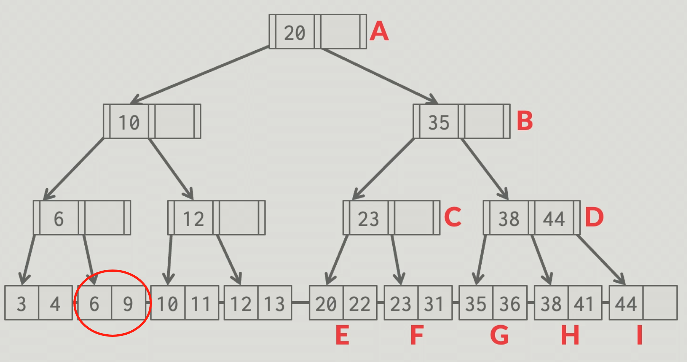

# Concurrency for B+ Tree

# 1. Insert

## A. Lock-Crabbing Concept Introduction

1. Starting from the root node, acquire a lock on the current node

2. Determine the next child node to access

3. Acquire a lock on the child node

4. After successfully locking the child node, release the parent node's lock only if the node doesn't need to split; if the node might need to split, don't release the parent node's lock

5. Continue traversing downward, repeating this process

## B. Execution Flow

### **a. No-Split Scenario**

**Inserting key 45**


- First lock node 20


- Then lock node 35


- After locking node 35, check if insertion requires splitting this node. Since no splitting is needed, unlock the parent node 20.


- Continue to lock node 38-44. Since we're not sure if node 38-44 will split, don't unlock node 35


- Lock node 44


- Since node 44 won't split, unlock all parent nodes. After key 45 is inserted, unlock node 44-45


### b. Split Scenario

**Inserting key 25**


- First lock node 20


- Then lock node 35


- After locking node 35, check if insertion requires splitting this node. Since no splitting is needed, unlock the parent node 20.


- Lock node 23 


- Unlock node 35, because no splitting is needed


- Lock node 23-31


- After completing the new node split, unlock nodes from bottom to top. **Note: The new node is not locked because it's only visible to the current thread, other threads cannot access this new node, so it doesn't need to be locked.**


## C. Testing Methods

### a. Basic Testing

- Compile three binary files

```go
# Compile server side
go build -buildvcs=false -o dinodb ./cmd/dinodb

# Compile client side
go build -buildvcs=false -o dinodb_client ./cmd/dinodb_client

# Compile stress testing tool
go build -buildvcs=false -o dinodb_stress ./cmd/dinodb_stress
```

- Workload file types:

  - i-a-sm.txt: Sequential small dataset (ascending, small)

  - i-i-sm.txt: Random small dataset (inconsecutive, small)

  - i-a-lg.txt: Sequential large dataset (ascending, large)

  - i-i-lg.txt: Random large dataset (inconsecutive, large)


- Complete test command

```
go test './test/concurrency/...' -race -timeout 180s -v
```

### b. Correctness Verification

- **Key Order**: Check if all keys are strictly in ascending order.
- **Recursive Child Node Check**: Recursively call `isBTree` on each child node to ensure all child nodes are valid B+ trees.

- **Consistency between Keys and Child Node Boundaries**: If there's a previous key, that key must be **less than or equal to** the left boundary of the child node.

- Using small datasets

The above tests are based on B+ tree properties where data in leaf nodes is sorted by key values, connected through right sibling pointers to form an ordered linked list that enables sequential traversal.

### c. Stress Testing

- Single-thread testing: One thread performs all insertion operations

- Multi-thread testing: Multiple threads simultaneously perform all insertion operations
- Using large datasets
- Single race condition file test command

```go
./dinodb_stress -index=btree -workload=workloads/i-a-sm.txt -n=8 -verify
```


**1. Sequential insertion of 10000 data records test**


**2. Random insertion of 10000 data records test**


### d. Additional Notes

- In multi-threaded stress tests, multiple threads will not execute the same command, because each thread starts from a different starting position (idx),

  using a step size n (total number of threads) to process commands in a jumping manner. For example, with 10 commands and 2 threads:

  - Thread 0: Processes commands #0,2,4,6,8
  - Thread 1: Processes commands #1,3,5,7,9

```go
// Workload allocation function
func handleWorkload(c chan string, wg *sync.WaitGroup, workload []string, idx int, n int) {
    defer wg.Done()
    // Each thread starts from idx, with step size n to process commands
    for i := idx; i < len(workload); i += n {
        time.Sleep(jitter())
        c <- workload[i]
    }
}

// Call in main function
for i := 0; i < *nFlag; i++ {
    wg.Add(1)
    go handleWorkload(c, &wg, workload, i, *nFlag)
}
```


# 2. Select and SelectRange

## A. Concept Introduction

- Use cursor mechanism with read locks to sequentially traverse from the top to the leftmost leaf node, ensuring final lock release through defer cursor.Close().
- When moving the cursor, adopt the strategy of "**lock the old node, then lock the new node, then unlock the old node, move to the new node**", ensuring at least one node is locked at any time, guaranteeing consistency during traversal.
- Use pessimistic read locks (RLock) allowing multiple read operations to execute concurrently while being mutually exclusive with write operations, and improve concurrent performance through minimal lock range (always locking only one node).

## B. Execution Flow

- Using Select as an example

- Lock head node 20


- Lock node 10


- Release node 20


- Same process until node 3-4, lock 3-4, release node 6


- After reading node 3-4, lock 6-9


- After releasing 3-4, execute the same process until the end.



## C. Testing Methods

### **a. Correctness Testing**

**1. Algorithm verification, recursively verifying the entire tree structure:**

- For internal nodes:

  - Check if each child node is a valid B+ tree

  - Verify key ordering: For each key k, ensure all keys in the left subtree ≤ k, all keys in the right subtree ≥ k

  - Recursively check each child node

- For leaf nodes:

  - Check if keys are arranged in ascending order (order relationship between adjacent keys)

  - Return the minimum and maximum keys in the leaf node

**2. Manual verification**

- Print the node data of each page of the B+ tree in the test, and check the critical split points

  

### **b. Performance Testing**

- Simply increasing the number of threads does not linearly improve performance 
- Significant performance degradation occurs with 16 threads
- Performance is relatively stable between 1-8 threads
- Although B+ tree read locks allow shared access, there are still performance bottlenecks under high concurrency.

