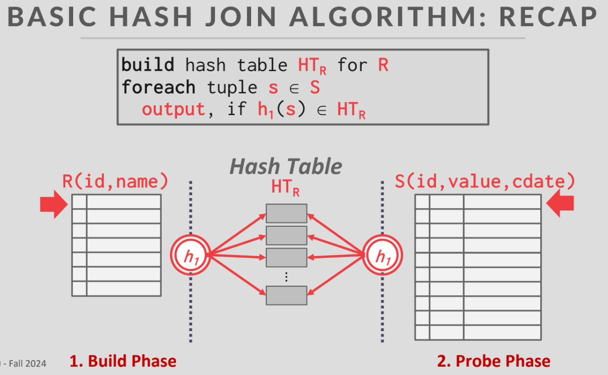
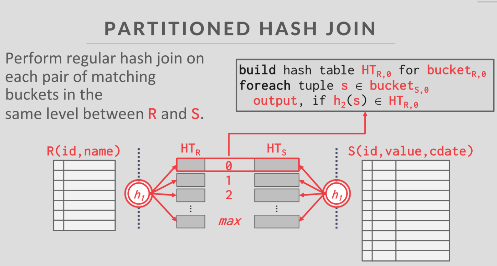
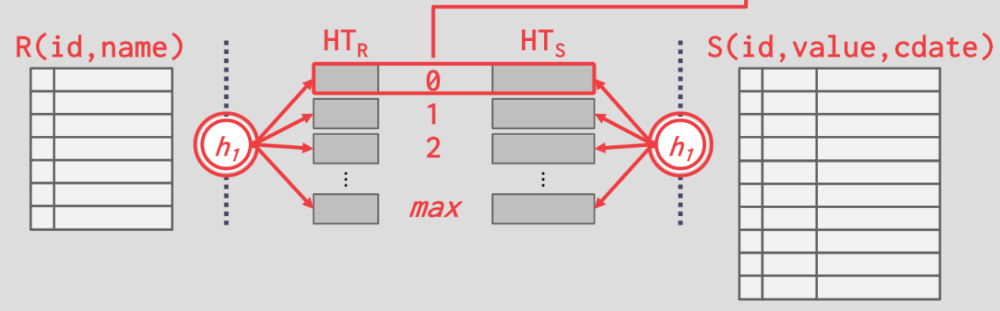
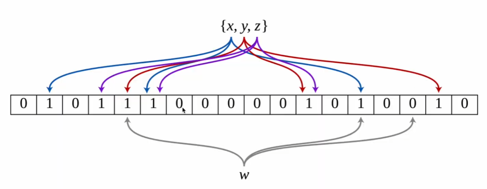
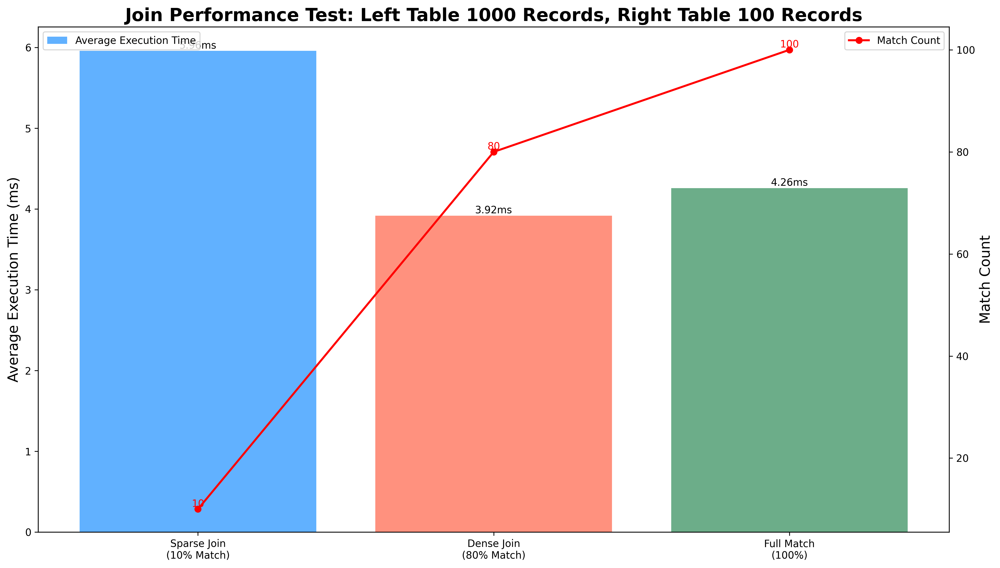
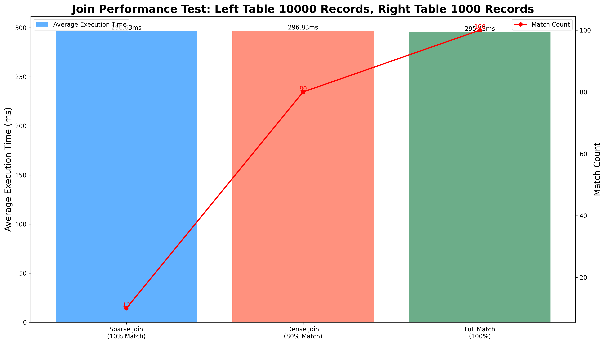

# Join

# 1. Important Concepts

## 1.1 Basic Hash Join

**1. Build Phase**:

- First, select one of the tables (typically the smaller table to save memory, let's assume it's table R) as the build table.
- For each tuple in table R, use the hash function h1 to calculate the hash value of its key.
- Use this hash value as an index to store the tuple in the corresponding bucket of the hash table HT_R.

**2. Probe Phase**:

- Then, for each tuple in the other table (here table S), use the same hash function h1 to calculate the hash value of its key.
- Use this hash value to look up the corresponding bucket in the hash table HT_R.
- If a matching bucket is found, search for the specific key in that bucket to determine if there are matching tuples.
- If matching keys are found, join these two tuples and output the result.

**3. Issues**

- If the hash table is too large to fit entirely in memory, part of the hash table needs to be written to disk, which significantly reduces performance.
- Assume table R: 100GB, table S: 200GB, hash table HT_R: needs to accommodate all data from table R ≈ 100GB.



## 1.2 Partitioned Hash Join

**1. Partition Build Phase**:

- Partition the two tables (R and S) using the same hash function, so that tuples with the same hash value are assigned to the same partition.
- Each partition corresponds to a "bucket", and R and S have the same number of partitions.

- For each partition, build a hash index (HT_R) for the corresponding partition of table R.

**2. Probe Phase**:

- Build a Bloom filter for table R in each partition.

- For each partition of S, iterate through the tuples, first using the Bloom filter to check if its join key possibly exists in the corresponding partition.
- Use the same hash function to calculate the hash value of table S tuples, and look for matching tuples in the corresponding hash table HT_R.
- If matching tuples are found, output the join result.




# 2. Hash Join Function

## 2.1 Join

### A. Parameter Introduction

```go
func Join(
    ctx context.Context,
    leftIndex database.Index,
    rightIndex database.Index,
    joinOnLeftKey bool,
    joinOnRightKey bool,
) (resultsChan chan EntryPair, ctxt context.Context, group *errgroup.Group, cleanupCallback func(), err error)
* Input parameters:
* ctx - Context for controlling operation cancellation
* leftIndex - Index of the left table
* rightIndex - Index of the right table
* joinOnLeftKey - Whether to use the key of the left table for joining
*                 true: Use key as the join key
*                 false: Use value as the join key
* joinOnRightKey - Whether to use the key of the right table for joining
*                  true: Use key as the join key
*                  false: Use value as the join key
*
* Return values:
* resultsChan - Join result channel, each result is an EntryPair
* ctxt - Returned context, for passing to the caller
* group - Error group, for handling errors in concurrent operations
* cleanupCallback - Cleanup function, for cleaning temporary resources (temporary hash index files)
* err - Error information
```

### B. Execution Flow

Using the following data as an example, in this example both joinOnLeftKey and joinOnRightKey are True

```
=== Left Table Inserted Data ===
Left table insert: key=0, value=0
Left table insert: key=1, value=100
Left table insert: key=2, value=200
Left table insert: key=3, value=300
Left table insert: key=4, value=400
Left table insert: key=5, value=500
Left table insert: key=6, value=600
Left table insert: key=7, value=700
Left table insert: key=8, value=800
Left table insert: key=9, value=900

=== Right Table Inserted Data ===
Right table insert: key=5, value=500
Right table insert: key=6, value=600
Right table insert: key=11, value=1100

=== Expected Matches ===
Expected match: Left table(5,500) matches Right table(5,500)
Expected match: Left table(6,600) matches Right table(6,600)
```

**1. Create Hash Indices for Left and Right Tables**

- Create hash indices for join keys based on joinOnLeftKey and joinOnRightKey. If True, the join key for the hash index is Key, otherwise it's Value.

- **Call buildHashIndex() to create hash indices for both tables.** The created hash indices are as follows:

​									**Left Table Temporary Hash Index (Initial)**

| **bucket[0] (pagenum=0)**    | **bucket[1] (pagenum=1)**    | **bucket[2] (pagenum=2)**    | **bucket[3] (pagenum=3)**    |
| :--------------------------- | :--------------------------- | :--------------------------- | :--------------------------- |
| `Bucket(0xc00011e528)`       | `Bucket(0xc00011e540)`       | `Bucket(0xc00011e558)`       | `Bucket(0xc00011e570)`       |
| ├── LocalDepth: 2            | ├── LocalDepth: 2            | ├── LocalDepth: 2            | ├── LocalDepth: 2            |
| ├── NumKeys: 2               | ├── NumKeys: 3               | ├── NumKeys: 3               | ├── NumKeys: 2               |
| └── Entries:                 | └── Entries:                 | └── Entries:                 | └── Entries:                 |
| ├── [0] {Key: 2, Value: 200} | ├── [0] {Key: 1, Value: 100} | ├── [0] {Key: 0, Value: 0}   | ├── [0] {Key: 5, Value: 500} |
| └── [1] {Key: 9, Value: 900} | ├── [1] {Key: 3, Value: 300} | ├── [1] {Key: 4, Value: 400} | └── [1] {Key: 6, Value: 600} |
|                              | └── [2] {Key: 8, Value: 800} | └── [2] {Key: 7, Value: 700} |                              |

​									**Right Table Temporary Hash Index (Initial)**

| **bucket[0] (pagenum=0)** | **bucket[1] (pagenum=1)** | **bucket[2] (pagenum=2)**      | **bucket[3] (pagenum=3)**    |
| :------------------------ | :------------------------ | :----------------------------- | :--------------------------- |
| `Bucket(0xc00011e6a8)`    | `Bucket(0xc00011e6c0)`    | `Bucket(0xc00011e6d8)`         | `Bucket(0xc00011e6f0)`       |
| ├── LocalDepth: 2         | ├── LocalDepth: 2         | ├── LocalDepth: 2              | ├── LocalDepth: 2            |
| ├── NumKeys: 0            | ├── NumKeys: 0            | ├── NumKeys: 1                 | ├── NumKeys: 2               |
| └── Entries:              | └── Entries:              | └── Entries:                   | └── Entries:                 |
|                           |                           | └── [0] {Key: 11, Value: 1100} | ├── [0] {Key: 5, Value: 500} |
|                           |                           |                                | └── [1] {Key: 6, Value: 600} |

**2. Ensure the Same Global Depth for Both Hash Indices**

- The global depth determines the size of the hash index directory (2^global depth), representing the number of buckets, which can be located by a certain number of bits of the hash value. For example, when global depth = 2, the number of buckets is 2 ^ 2 = 4
- The purpose of extending both hash indices to the same global depth is to ensure that during the probe phase, each bucket has a corresponding matching bucket on the other side.

- Note: The directory size is 2^global depth, but the actual number of physical buckets may be fewer because multiple directory entries may point to the same physical bucket (physical page). For example, when a bucket's LocalDepth is less than GlobalDepth, multiple directory entries will point to the same physical bucket (physical page).

**3. Probe Phase**

- Get all bucket page numbers from left and right, stored in the form of directory arrays, storing bucket page numbers
- Create a "seen" set to skip duplicate bucket pairs, for example:

```
Suppose left table GlobalDepth=2, but some buckets' LocalDepth is still 1
Right table GlobalDepth=1, all buckets' LocalDepth equals 1, after ensuring both hash indices have the same global depth, extended to GlobalDepth=2

leftBuckets = [0,1,2,1]   // Here we can see leftBuckets[1] and leftBuckets[3] share a physical bucket, because their local depth = 1
rightBuckets = [5,6,5,6]  // Here we can see rightBuckets[0] and rightBuckets[2], rightBuckets[1] and rightBuckets[3] share physical buckets, because their local depth = 1

Processing:
1. i=0: pair{l:0, r:5} -> First encounter, add to seenList, process this bucket pair
2. i=1: pair{l:1, r:6} -> First encounter, add to seenList, process this bucket pair
3. i=2: pair{l:2, r:5} -> First encounter, add to seenList, process this bucket pair
4. i=3: pair{l:1, r:6} -> Already in seenList, skip
```

- **Get the corresponding buckets from left and right tables, execute probeBuckets() to match key-value pairs in associated buckets**, obtaining matching key-value pairs between buckets on both sides.
- Finally, return all matching record pairs through resultsChan. In this example, only bucket[3] on both sides have matching keys, and the final result structure is:

```
type EntryPair struct {
    L entry.Entry  // Left table matching record
    R entry.Entry  // Right table matching record
}

Specific results:
EntryPair{
    L: Entry{Key: 5, Value: 500},
    R: Entry{Key: 5, Value: 500}
}
EntryPair{
    L: Entry{Key: 6, Value: 600},
    R: Entry{Key: 6, Value: 600}
}
```

## 2.2 buildHashIndex

### A. Parameter Introduction

```go
func buildHashIndex(
    sourceIndex database.Index,
    useKey bool,
)
* Input parameters:
* sourceIndex - Table index
* useKey - Whether to use the table's key for joining
*          true: Use key as the join key
*          false: Use value as the join key
* Return values:
* tempIndex - Returns the built temporary hash index, where buckets store either the original record's key or value as the hash key, depending on useKey
* dbName - Name of the temporary database file, for subsequent resource cleanup
* err - Error information
```

### B. Execution Flow

**1. Initialize Temporary Storage**:

- Create a temporary database file to get dbName
- Initialize temporary hash index tempIndex using dbName

**2. Traverse Source Table Data**:

- Get the source table's cursor, used to iterate through all records
- Iterate through each record using the cursor

**3. Build Temporary Hash Index**:

- Decide whether to use the original record's key or value as the new record's key based on useKey.

- Insert the new record into the temporary hash index

- **The Insert() function will hash the new key using h1(key), determining which bucket to store the record in**

  ```go
  // Insert inserts a key-value pair into the hash index
  func (table *HashTable) Insert(key int64, value int64) error {
     // 1. Calculate hash value to determine which bucket to insert into, Hasher is h1 in the diagram
     hash := Hasher(key, table.globalDepth)  // Use key and global depth to calculate bucket index
     
     // 2. Get the corresponding bucket
     bucket, err := table.GetBucket(hash)
     if err != nil {
         return err
     }
  
     // 3. Insert the key-value pair into the bucket
     needSplit := bucket.Insert(key, value)  
  ```



**4. Return Results**:

- Return the built temporary hash index tempIndex
- Return the temporary database file name dbName for subsequent cleanup

## 2.3 probeBuckets

### A. Parameter Introduction

```go
func probeBuckets(
   ctx context.Context,
   resultsChan chan EntryPair,
   lBucket *hash.HashBucket,
   rBucket *hash.HashBucket,
   joinOnLeftKey bool,  
   joinOnRightKey bool,
)
* Input parameters:
* ctx - Context for controlling operation cancellation
* resultsChan - Result channel for sending matching record pairs
* lBucket - Left table's bucket
* rBucket - Right table's bucket
* joinOnLeftKey - Whether to use the left table record's key for joining
*                true: Use key as the join key
*                false: Use value as the join key
* joinOnRightKey - Whether to use the right table record's key for joining
*                 true: Use key as the join key
*                 false: Use value as the join key
* Return values:
* error - Error information
```

### **B. Execution Flow**

**1. Build Phase for Larger Table**

- **Note: Only at this point is a hash table built; previous steps built hash indices**
- Choose the larger bucket to build a **hash table and Bloom filter** based on the size of left and right buckets.
- Use the key from the key-value pairs in the larger bucket as the hash table's key, and the entire key-value pair entry as the value.

**2. Probe Phase for Smaller Table**

- Iterate through each key-value pair in the smaller table, first querying the key in the larger table's Bloom filter. If the key is not found in the larger table's Bloom filter, it definitely doesn't have a matching key in the larger table, so skip the search.
- If the Bloom filter returns True, it means the larger table might have a matching key, continue searching for matching key-value pairs in the larger table's hash table
  - If matching key-value pairs are found, swap the positions of Key and Value based on the boolean values of joinOnLeftKey and joinOnRightKey, and add the two matching key-value pairs to the result set.
  - If no matching key-value pairs are found, it means the Bloom filter reported a false positive, then skip and continue processing the next key-value pair in the smaller table.

# 3. BloomFilter Function



### A. Parameter Introduction

```go
func CreateFilter(size int64) (bf *BloomFilter)
* Input parameters:
* size - Size of the Bloom filter bit array, default 1024 bits
* Return values:
* bf - Returns the initialized Bloom filter, including a bit array of size

* Example:
filter := CreateFilter(1024)  // Create a 1024-bit Bloom filter
```

```go
func (filter *BloomFilter) Insert(key int64)
* Input parameters:
* key - Key to insert
* Execution:
* 1. Use two different hash functions to calculate positions:
*    - h1 = XxHash(key) % size
*    - h2 = MurmurHash(key) % size
* 2. Set the bits at these two positions to 1

* Example:
When key=5:
h1 = XxHash(5) % 1024 = 123    // Assumed result
h2 = MurmurHash(5) % 1024 = 456
Set bits[123] and bits[456] to 1
```

```go
func (filter *BloomFilter) Contains(key int64) bool
* Input parameters:
* key - Key to search for
* Return values:
* bool - true indicates possibly exists, false indicates definitely doesn't exist
* Execution:
* 1. Use the same two hash functions to calculate positions
* 2. Check if both positions are 1
* 3. Return true if both are 1, return false if any is 0

* Example:
When key=5:
h1 = XxHash(5) % 1024 = 123
h2 = MurmurHash(5) % 1024 = 456
Check bits[123] and bits[456]:
- Both are 1: return true (possibly exists)
- Any is 0: return false (definitely doesn't exist)
```

### B. Execution Flow

**1. Create Bloom Filter**

- In this project, the Bloom filter size is 1024 bits.

**2. Insert Keys**

- Use multiple different hash functions to calculate positions for the key, set those positions to 1

**3. Query Keys**

- Use the same hash functions as in insertion to calculate positions for the key
  - If all corresponding positions are 1, the same key might exist in the database
  - If any position is not 1, the same key definitely doesn't exist in the database
  - A Bloom filter may report false positives (i.e., reporting a key exists when it doesn't), but will never report false negatives for existing keys

### **C. Performance Analysis**

- Bloom filter check only needs to access two bit positions

- Hash table lookup requires hash calculation, collision handling, etc.

- When many records don't match, Bloom filters can quickly filter out these records

# 4. Testing Methods

## 4.1 Correctness Testing

- As in the example above, verify functionality correctly with small datasets
- Verify key-key, key-value, value-key joins work correctly
- Verify result quantity and values meet expectations

## 4.2 Performance Testing

**a. Left table with 1000 records, right table with 100 records, time consumed for 10 runs with different densities**



**b. Left table with 10000 records, right table with 1000 records, time consumed for 10 runs with different densities**



- As data volume increases, execution time grows linearly 
- With large data volumes, performance is very stable across different match rates

- With small data volumes, match rate significantly affects performance
- With large data volumes, the impact of match rate tends to flatten