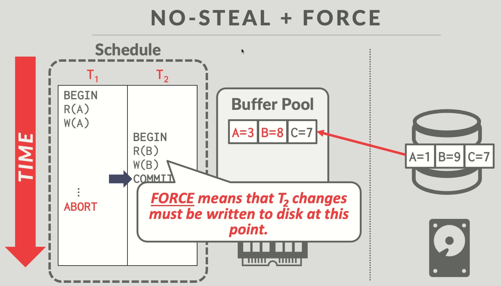

# RecoveryManager

# 1. Important Concepts

## 1.1 STEAL and FORCE Strategies

### A. STEAL / NO-STEAL Strategy

**Definition**: The STEAL strategy determines whether the DBMS allows updates from uncommitted transactions to be written back to disk.

- STEAL: Allows pages from uncommitted transactions to be written back to disk
  - Advantage: More flexible memory management, especially when buffer space is limited
  - Challenge: Requires implementation of UNDO mechanism to handle transactions that were written to disk but later rolled back
- NO-STEAL: Does not allow pages from uncommitted transactions to be written back to disk
  - Advantage: Simplifies recovery process (no need for undo operations)
  - Disadvantage: Creates memory pressure, as all modifications must be retained until the transaction commits

### B. FORCE / NO-FORCE Strategy

**Definition**: The FORCE strategy determines whether all updates must be written to disk before a transaction can commit.

- FORCE: Requires all updates to be written to disk before a transaction can commit
  - Advantage: Directly guarantees durability, no need for additional recovery steps
  - Disadvantage: Requires synchronous I/O for each commit, high performance overhead
- NO-FORCE: Does not require updates to be written to disk before a transaction commits
  - Advantage: Significantly improves performance, allows asynchronous batch writes
  - Challenge: Requires REDO mechanism to ensure durability after a crash

### C. Disadvantages of NO-STEAL / FORCE Strategy



**1. Extra memory needed to maintain special page versions**

- If T1 modifies A first without committing, then T2 modifies B and commits.
- Due to the NO-STEAL policy, T1's modification to A can only be kept in memory, not written to disk
- When T2 needs to commit, assuming B and A are on the same data page, and that page already contains uncommitted modifications from T1, this creates a problem: the system cannot directly write the entire page to disk, as this would violate the NO-STEAL principle (it would write T1's uncommitted modifications), and the system cannot simply "only write B's modifications" because disk I/O typically operates at the page level
- The system needs to create a special version of that data page that only includes T2's modifications (B's new value), without T1's modifications (keeping A's original value), and then write this specially constructed page to disk

**2. Commit storm problem**

- Under NO-STEAL/FORCE strategy, when a transaction commits, the system must create special page versions that only include modifications from that transaction while excluding all uncommitted transactions' modifications (reason #1), requiring maintenance of complex version chains to track which transaction's modifications are committed, with high computational overhead and memory usage.
- If multiple transactions commit almost simultaneously (commit storm), the system needs to separately calculate and create special pages for each committing transaction based on this complex version chain, then write them to disk individually, causing multiple repetitive I/O operations on the same page, greatly wasting system resources and causing performance collapse.

**3. Uncommitted transactions consuming large amounts of memory**

- Under the NO-STEAL strategy, all modifications made by long-running but uncommitted transactions must be kept entirely in memory, cannot be written to disk to free up space, causing continuous increase in system memory pressure. If such a transaction involves large-scale data modifications (such as batch updating millions of records), it will occupy large amounts of valuable memory resources, severely limiting system concurrency capabilities and potentially leading to memory exhaustion.

## 1.2 WAL and ARIES Recovery Protocol

- WAL (Write-Ahead Logging) and ARIES (Algorithm for Recovery and Isolation Exploiting Semantics) are core concepts of database recovery systems based on the **STEAL / NO-FORCE** strategy. This project implements a simplified version of the ARIES protocol, including the following three phases:

### Phase #1 – Analysis Phase

- **Identify transactions that were active at the time of the crash from the beginning of the table**
- Determine which tables need recovery, active uncommitted transactions need to be undone later
- Build a transaction status table, tracking operation records for each transaction

### Phase #2 – Redo Phase

- **Redo all transactions whether committed or not**
- Ensure all persisted operations are correctly applied to the database state

### Phase #3 – Undo Phase

- **Undo all operations of all uncommitted transactions in reverse order, up to the earliest log record of transactions active at the time of the crash**
- Finally mark all uncommitted transactions as rolled back

## 1.3 ARIES Recovery Diagram Explanation


- The diagram shows the key elements of the ARIES recovery protocol:

  - **WAL Log**: Vertical list of records, arranged in chronological order from top to bottom

  - **TIME Arrow**: Indicates the flow of time, from top to bottom

  - **Start of last checkpoint**: Position of the most recent checkpoint, the starting point for the recovery redo phase

  - **Oldest log record of txn active at crash**: The earliest log record of transactions still active (uncommitted) at the time of the crash
    - This is a key concept in ARIES, it may be far before the most recent checkpoint
    - Indicates how far back the undo phase may need to roll back
    - Example: If a long-running transaction started before the checkpoint, even though its data modifications were flushed to disk at checkpoint time, because the transaction is uncommitted, **all operations of that transaction must still be completely undone** during recovery

## 1.4 WAL Principle

- Any operation that modifies the database state **must first be written to the log, then execute the actual operation**, mainly to:
  - redo log is sequential write, better performance
  - even if the system crashes before the modified data page is flushed to disk, it can be recovered through the redo log
  - reduces random I/O, improves database performance
  
- Actual code example:

```go
func HandleInsert(db *database.Database, tm *concurrency.TransactionManager, rm *RecoveryManager, payload string, clientId uuid.UUID) (err error) {
    // ...parameter parsing omitted...
    // First write to log
    err = rm.Edit(clientId, table, INSERT_ACTION, int64(key), 0, int64(newval))
    if err != nil {
        return err
    }
    
    // Then execute the actual insert operation
    err = concurrency.HandleInsert(db, tm, payload, clientId)
    // ...error handling...
    
    return err
}
```

## 1.5 Log File Structure

```go
type editLog struct {
    id        uuid.UUID // The id of the transaction this edit was done in
    tablename string    // The name of the table where the edit took place
    action    action    // The type of edit action taken
    key       int64     // The key of the tuple that was edited
    oldval    int64     // The old value before the edit
    newval    int64     // The new value after the edit
}
startLog{
		id: clientId, // Constructed in start function 
}
commitLog{
		id: clientId, // Constructed in Commit function
}
```

- All types of logs (table creation, edit, transaction start/commit, checkpoint) are written to **the same log file in chronological order, all logs from all tables are written to the same table**

- Logs are stored in text form, each record occupies one line
- After each write operation, `Sync()` is immediately called to ensure the log is persistently stored

- Log example:

  ```
  < create btree table students >
  < 123e4567-e89b-12d3-a456-426614174000 start >
  < 123e4567-e89b-12d3-a456-426614174000, students, INSERT, 10, 0, 100 >
  < 123e4567-e89b-12d3-a456-426614174000, students, UPDATE, 10, 100, 200 >
  < 123e4567-e89b-12d3-a456-426614174000 commit >
  < 456e7890-e89b-12d3-a456-426614174000 start >
  < 456e7890-e89b-12d3-a456-426614174000, students, INSERT, 20, 0, 300 >
  < 123e4567-e89b-12d3-a456-426614174000, 456e7890-e89b-12d3-a456-426614174000 checkpoint >
  < 789e0123-e89b-12d3-a456-426614174000 start >
  < 789e0123-e89b-12d3-a456-426614174000, students, INSERT, 30, 0, 400 >
  < 456e7890-e89b-12d3-a456-426614174000, students, DELETE, 20, 300, 0 >
  < 456e7890-e89b-12d3-a456-426614174000 commit >
  < 789e0123-e89b-12d3-a456-426614174000, students, UPDATE, 30, 400, 500 >
  ```

- During recovery, the system will start analysis from the checkpoint, identify active transactions (in this example, transaction 789e0123), then redo operations of committed transactions (in this example, transaction 456e7890), and finally undo operations of uncommitted (active) transactions.

# 2. Core Fields

```go
type RecoveryManager struct {
	db *database.Database              // The underlying database this recovery manager is responsible for
	tm *concurrency.TransactionManager // Transaction manager used for this database

	// Track operations of all uncommitted transactions
	// Maps each client/transaction ID to a log stack
	txStack map[uuid.UUID][]editLog

	logFile *os.File   // Log file for storing the write-ahead log (WAL)
	mtx     sync.Mutex // Mutex for ensuring this structure can be safely used concurrently
}
```

## 2.1 db

```go
db *database.Database
```

- Function: Pointer to the underlying database instance

- Role: Allows RecoveryManager to access the database's tables, indexes, and other data structures

- Implementation: Passed in when initializing RecoveryManager, used for data recovery and data operations

- Example:

```go
// Using the db field to access the database
tables := rm.db.GetTables()
table, err := rm.db.GetTable("users")
```

## 2.2 tm

```go
tm *concurrency.TransactionManager
```

- Function: Pointer to the transaction manager

- Role: Responsible for managing database transactions, including lock acquisition and release

- Implementation: Passed in when initializing RecoveryManager, used for transaction operations

- Example:

```go
// Using the tm field to manage transactions
err := rm.tm.Begin(clientId)
err := rm.tm.Lock(clientId, table, key, concurrency.W_LOCK)
err := rm.tm.Commit(clientId)
```

## 2.3 txStack 

```go
txStack map[uuid.UUID][]editLog

type editLog struct {
    id        uuid.UUID // Transaction ID
    tablename string    // Table name
    action    action    // Operation type (INSERT/UPDATE/DELETE)
    key       int64     // Key being operated on
    oldval    int64     // Value before the operation
    newval    int64     // Value after the operation
}
```

- Function: Maintains a hash map of operation logs for all uncommitted (active) transactions

- Role: Used for rollback operations and crash recovery, records all modification operations for each transaction

- Implementation: Hash map using transaction ID as key and array of editLog as value

- Structure example:

```go
txStack = {
    "uuid1": [
        editLog{id: "uuid1", tablename: "users", action: INSERT_ACTION, key: 1, oldval: 0, newval: 100},
        editLog{id: "uuid1", tablename: "users", action: UPDATE_ACTION, key: 2, oldval: 50, newval: 150},
    ],
    "uuid2": [
        editLog{id: "uuid2", tablename: "orders", action: DELETE_ACTION, key: 5, oldval: 200, newval: 0},
    ]
}
```

- Operation example:

```go
// Add log to transaction stack
rm.txStack[clientId] = append(rm.txStack[clientId], el) // el = editLog

// Delete corresponding log stack when transaction commits
delete(rm.txStack, clientId)
```

## 2.4 logFile

```go
logFile *os.File
```

- Function: File pointer to the write-ahead log (WAL)

- Role: Used for persistently storing all data modification operations, ensuring crash recovery

- Implementation: Opened when initializing RecoveryManager, written in append mode

- Example:

```go
// Write log to file
_, err := rm.logFile.WriteString(log.toString())
err = rm.logFile.Sync() // Ensure data is flushed to disk
```

## 2.5 mtx

- Function: Mutex, mainly used to protect concurrent access to the txStack map
- Role: Ensure multiple transactions don't read or write to txStack simultaneously, avoiding data inconsistency or program crashes due to concurrent modifications
- Implementation: Standard Go mutex, used for synchronizing access

# 3. Core Functions

## 3.1 Table (Create Table Object)

```go
func (rm *RecoveryManager) Table(tblType string, tblName string) error
```

### A. Parameter Introduction

- Parameters:

  - `tblType string`: Type of table, usually "btree" or "hash"

  - `tblName string`: Name of the table

- Returns:
  - `error`: If log writing fails, returns an error; otherwise returns nil

- Purpose:
  - Record **table creation operation** in the write-ahead log (WAL), ensuring tables can be recreated during system crash and recovery

- Notes:
  - Table creation logs are not associated with any specific transaction, so they are not added to txStack
  - This method should be called immediately after actually creating the table, ensuring table structure is correctly recorded

### B. Complete Flow

**1. Concurrency Control**

- Acquire the mutex of `RecoveryManager`, protecting thread-safe operations for writing logs to disk

- Use defer statement to ensure the lock is released when the function ends, preventing deadlocks

**2. Create and Write Log Object**

- Create a tableLog structure instance, fill in the table type and table name into the log object

  ```
  tl := tableLog{
      tblType: tblType,
      tblName: tblName,
  }
  ```

- Call the `flushLog()` method to serialize the log and write it to the log file, ensuring the log is persistently stored before actual data modification (core principle of write-ahead logging)

**3. Return Result**

- If everything is normal, return nil indicating successful operation

### C. Record Example

- Execute `rm.Table("btree", "students")`, creating a B+ tree type "students" table, the log file will record

  ```
  < create btree table students >

## 3.2 Start (Begin a Single Active Transaction)

```go
func (rm *RecoveryManager) Start(clientId uuid.UUID) error
```

### A. Parameter Introduction

- Parameters:
  - `clientId uuid.UUID`: Unique identifier of the transaction/client to start
- Returns:
  - `error`: If log writing fails, returns an error; otherwise returns nil
- Purpose:
  - Mark the beginning of a transaction, and record this event in the write-ahead log (WAL)
  - Create an empty transaction operation key-value pair in txStack, used to track all subsequent modification operations of this transaction
- Notes:
  - This method must be called before any data modification is performed for each transaction
  - Start logs are used to determine which transactions were active at the time of crash during recovery

### B. Complete Flow

**1. Concurrency Control**

- Acquire the mutex of `RecoveryManager`, protecting access to shared resources; use defer statement to ensure the lock is released when the function ends, preventing deadlocks

**2. Create and Write Log Object**

- Create a startLog structure instance, fill in the client (transaction) ID into the log object

  ```
  	sl := startLog{
  		id: clientId,
  	}
  ```

- Call the `flushLog()` method to serialize the log and write it to the log file, flushing to disk

**3. Initialize Transaction State**

- Create an empty edit log array entry for this transaction in the txStack mapping
- This key-value pair will be used to track all operations in the transaction, for rollback when needed

**4. Return Result**

- If operation is successful, return nil
- If an error occurs, return error with context information

### C. Creation Example

- Execute `rm.Start(uuid.MustParse("123e4567-e89b-12d3-a456-426614174000"))`, starting a new transaction, the log file will record

  ```
  < 123e4567-e89b-12d3-a456-426614174000 start >
  ```

- Note: Here we assume the UUID value `123e4567-e89b-12d3-a456-426614174000` represents the transaction ID (tx1)

## 3.3 Edit (Single Edit Operation)

```go
func (rm *RecoveryManager) Edit(clientId uuid.UUID, table database.Index, action action, key int64, oldval int64, newval int64) error
```

### A. Parameter Introduction

- Parameters:
  - `clientId uuid.UUID`: Unique identifier of the client/transaction
  - `table database.Index`: Table object to be modified
  - `action action`: Operation type (INSERT_ACTION, UPDATE_ACTION, DELETE_ACTION)
  - `key int64`: Key value of the record to be modified
  - `oldval int64`: Value before modification (usually 0 for insert operations)
  - `newval int64`: Value after modification (usually 0 for delete operations)
- Returns:
  - `error`: If log writing fails, returns an error; otherwise returns nil
- Purpose:
  - Record data modification operations in the write-ahead log (WAL), ensuring operations can be recovered or rolled back in case of system crash
- Notes:
  - Following the WAL principle, log must be recorded first, then the actual modification operation executed
  - Each edit log is associated with a specific transaction and stored in txStack for possible rollback operations

### B. Complete Flow

**1. Concurrency Control**

- Acquire the mutex of `RecoveryManager`, protecting access to shared resources; use defer statement to ensure the lock is released when the function ends, preventing deadlocks

**2. Create and Write Log Object**

- Create an editLog structure instance, fill in transaction ID, table name, operation type, key value, and old and new values

  ```
  	el := editLog{
  		id:        clientId,
  		tablename: table.GetName(),
  		action:    action,
  		key:       key,
  		oldval:    oldval,
  		newval:    newval,
  	}
  ```

- Call the `flushLog()` method to serialize the log and immediately write it to the log file, flushing to disk

**3. Update Transaction State**

- Check if a log record for this transaction already exists in txStack, if not, initialize it
- Add the current edit log to the log stack of the corresponding transaction, for potential transaction rollback

**4. Return Result**

- If operation is successful, return nil
- If an error occurs, return error with context information

### C. Edit Example

- Execute insert operation: `rm.Edit(tx1, studentsTable, INSERT_ACTION, 10, 0, 100)`, the log file will record

  ```
  < 123e4567-e89b-12d3-a456-426614174000, students, INSERT, 10, 0, 100 >
  ```

- Execute update operation: `rm.Edit(tx1, studentsTable, UPDATE_ACTION, 10, 100, 200)`, the log file will record

  ```
  < 123e4567-e89b-12d3-a456-426614174000, students, UPDATE, 10, 100, 200 >
  ```

- Execute delete operation: `rm.Edit(tx1, studentsTable, DELETE_ACTION, 10, 200, 0)`, the log file will record

  ```
  < 123e4567-e89b-12d3-a456-426614174000, students, DELETE, 10, 200, 0 >
  ```

- Note: Here we assume the UUID value `123e4567-e89b-12d3-a456-426614174000` represents the transaction ID (tx1)

## 3.4 Commit (Commit This Transaction)

```go
func (rm *RecoveryManager) Commit(clientId uuid.UUID) error
```

### A. Parameter Introduction

- Parameters:
  - `clientId uuid.UUID`: Unique identifier of the transaction/client to commit
- Returns:
  - `error`: If log writing fails, returns an error; otherwise returns nil
- Purpose:
  - Mark the successful completion of a transaction, and record this event in the write-ahead log (WAL)
  - Remove the operation record of this transaction from the transaction tracking system
- Notes:
  - This method is called after a transaction completes all operations to confirm the transaction has successfully completed
  - Commit logs are used to determine which transactions were successfully completed before a crash during recovery

- **Commit operation does not immediately write data to disk:**
  - The reason was mentioned in 1.1.C Disadvantages of NO-STEAL / FORCE strategy:
    - Need extra memory to maintain special page versions
    - Commit storm problem

### B. Complete Flow

**1. Concurrency Control**

- Acquire the mutex of `RecoveryManager`, protecting access to shared resources; use defer statement to ensure the lock is released when the function ends, preventing deadlocks

**2. Create and Write Log Object**

- Create a commitLog structure instance, fill in the client (transaction ID) into the log object

  ```
  	cl := commitLog{
  		id: clientId,
  	}
  ```

- Call the `flushLog()` method to serialize the log and write it to the log file, flushing to disk

**3. Clean Up Transaction State**

- Delete the entry for this transaction from the txStack active transaction hash map
- This indicates the transaction has successfully completed, its operations don't need to be undone during rollback

**4. Return Result**

- If operation is successful, return nil
- If an error occurs, return error with context information

### C. Commit Example

- Execute `rm.Commit(uuid.MustParse("123e4567-e89b-12d3-a456-426614174000"))`, committing a transaction, the log file will record

  ```
  < 123e4567-e89b-12d3-a456-426614174000 commit >
  ```

## 3.5 Checkpoint (Flush All Transactions to Disk)

```go
func (rm *RecoveryManager) Checkpoint() error
```

### A. Parameter Introduction

- Parameters:
  - None
- Returns:
  - `error`: If log writing or page flushing fails, returns an error; otherwise returns nil
- Purpose:
  - Create a consistency snapshot of the database, flush all modifications in memory to disk
  - Record all currently active (uncommitted) transactions, providing a starting point for recovery
  - Back up database state for potential recovery
- Notes:
  - Reduces recovery time after system crash, only needing to replay logs after the checkpoint
  - Unlike traditional WAL implementations, this implementation does not clean up or truncate the log file

- **Uncommitted transactions also need to be flushed to disk:**

  - If a data page contains both committed and uncommitted modifications, if the policy is to not flush uncommitted transactions to disk, when checkpoint is called, you cannot directly flush the entire page to disk, must create additional "clean version" data pages: containing only committed transaction modifications and data before uncommitted transaction modifications. Since database I/O is page-based, this approach would lead to large amounts of additional memory copying and disk write operations, severely affecting performance.

  - If only pages from committed transactions are flushed, uncommitted transactions may occupy a large number of memory pages in the unpinned List of the memory pool for a long time, causing dirty pages to not be synchronized to disk for too long, resulting in all new pages needing to be read from disk. Consider the following extreme scenario:

    - Buffer pool size: 1000 pages

    - Long transaction T1: Modified 400 pages but not committed

    - Daily operations: Need to frequently access another 800 pages

    Problem:

    - If T1's dirty pages cannot be flushed to disk, the system only has 600 pages available
    - The working set of 800 pages cannot all remain in memory
    - Leads to frequent page swapping
    - Performance significantly decreases

### B. Complete Flow

**1. Concurrency Control**

- Acquire the mutex of `RecoveryManager`, protecting access to shared resources; use defer statement to ensure the lock is released when the function ends, preventing deadlocks

**2. Get All Tables**

- Call `db.GetTables()` to get all tables in the database

**3. Flush All Data Pages to Disk**

- For each table, get its page manager (Pager)
- Lock all pages, perform flushing operation, then unlock
- **Ensure all changes in memory are persisted to disk**

**4. Collect Active Transactions**

- Create an empty list of active transaction IDs
- Iterate through the txStack hash map, collect the IDs of all uncommitted transactions, the purpose is to record all active transaction IDs in the checkpoint log, after which the first analysis phase of crash recovery doesn't need to scan the entire table. After the checkpoint records all active transaction IDs, when scanning for active transactions at crash time, **the formula for obtaining active transactions at crash time is: active transactions at crash = active transactions at most recent checkpoint - transactions committed after most recent checkpoint + transactions started after checkpoint.** In other words, the system doesn't need to scan the entire log to determine active transactions at crash time, **it only needs to scan the log forward from the checkpoint to get the active transactions at crash time.** This greatly reduces the scanning cost.

**5. Create and Write Checkpoint Log**

- Create a checkpoint log object containing all active transaction IDs

  ```
  	cl := checkpointLog{
  		ids: activeIds,
  	}
  ```

- Call `flushLog()` to ensure the log is persisted to disk

**6. Backup Database**

- Call the `delta()` method to create a backup of the current database state
  - The `delta()` function actually creates a physical copy of the entire database file
- Copy all data files to the recovery directory for future recovery use

**7. Return Result**

- If operation is successful, return nil
- If an error occurs, return error with context information

### C. Record Example

- Execute `rm.Checkpoint()`, when transactions "123e4567" and "456e7890" are active, the log file will record

  ```
  < 123e4567-e89b-12d3-a456-426614174000, 456e7890-e89b-12d3-a456-426614174000 checkpoint >
  ```

- If there are no active transactions, it will record

  ```
  < checkpoint >
  ```


## 3.6 Redo (Redo Single Command)

```go
func (rm *RecoveryManager) redo(log log) error
```

### A. Parameter Introduction

- Parameters:
  - `log log`: Log entry to redo, can be tableLog or editLog type
- Returns:
  - `error`: If redo operation fails, returns an error; otherwise returns nil
- **Purpose:**
  - **Re-execute operations recorded in the log during recovery process, but without generating new log records**
  - Used to restore database state to a consistent state before the crash
- Notes:
  - Dedicated to recovery process, redo operations will not write to the log file again
  - Contains special error handling logic for operation failures that may be caused by inconsistent system state

### B. Complete Flow

**1. Use `switch` Type Assertion to Handle Different Types of Logs**

- For table creation logs (tableLog)
  - Construct table creation command string
    - `payload := fmt.Sprintf("create %s table %s", log.tblType, log.tblName)`
  - Call database handler function to execute table creation
  - Return error if fails
- For edit logs (editLog), execute based on operation type:
  - Insert operation (INSERT_ACTION)
    - Construct insert command string
      - `payload := fmt.Sprintf("insert %v %v into %s", log.key, log.newval, log.tablename)`
    - Try to execute insert operation `database.HandleInsert(rm.db, payload)`
      - If insert fails (key may already exist), try update operation
      - If update also fails, return error
  - Update operation (UPDATE_ACTION)
    - Construct update command string
      - `payload := fmt.Sprintf("update %s %v %v", log.tablename, log.key, log.newval)`
    - Try to execute update operation `database.HandleUpdate(rm.db, payload)`
      - If update fails (key may not exist), try insert operation
  - Delete operation (DELETE_ACTION)
    - Construct delete command string
      - `payload := fmt.Sprintf("delete %v from %s", log.key, log.tablename)`
    - Execute delete operation `database.HandleDelete(rm.db, payload)`
- For unsupported log types
  - Return error, indicating only table creation or edit logs can be redone

**2. Return Result**

- If all operations execute successfully, return nil
- If an error occurs, return corresponding error

### C. Recovery Example

- When redoing a table creation log:

  ```
  < create btree table students >
  ```

  1. Execute `create btree table students`
  2. If the table already exists, return an error, the recovery process will ignore this error and continue execution

- When redoing an insert operation:

  ```
  < 123e4567-e89b-12d3-a456-426614174000, students, INSERT, 10, 0, 100 >
  ```

  1. Try to execute `insert 10 100 into students`
  2. If the key already exists, try to execute `update students 10 100`

- When redoing an update operation:

  ```
  < 123e4567-e89b-12d3-a456-426614174000, students, UPDATE, 10, 100, 200 >
  ```

  1. Try to execute `update students 10 200`
  2. If the record doesn't exist, try to execute `insert 10 200 into students`

- When redoing a delete operation:

  ```
  < 123e4567-e89b-12d3-a456-426614174000, students, DELETE, 10, 100, 0 >
  ```

  1. Execute `delete 10 from students`
  2. If the record doesn't exist, return an error, the recovery process will handle this error

## 3.7 Undo (Undo Single Command)

```go
func (rm *RecoveryManager) undo(log editLog) error
```

### A. Parameter Introduction

- Parameters:
  - `log editLog`: Edit log record to be undone

- **Returns:**
  - `error`: If the undo operation fails, returns the corresponding error; if successful, returns `nil`.

- **Purpose:**
  - **Perform the opposite operation of what is recorded in the edit log, to undo previous modifications to the database, thus helping the database roll back to a consistent state.**

- **Notes:**

  - Undo operations are specifically for recovery and transaction rollback processes.

  - Depending on the operation type, construct the appropriate undo command (such as delete, update, or insert), and call the corresponding handler function to complete the operation.

### B. Complete Flow

**1. Use `switch` Type Assertion to Handle Different Types of Logs**

- **For insert operations (`INSERT_ACTION`):**

  - The original operation was to insert a record, the undo requires deleting this record.

  - Construct command string:
    `payload := fmt.Sprintf("delete %v from %s", log.key, log.tablename)`

  - Call function: `HandleDelete(rm.db, rm.tm, rm, payload, log.id)`

- **For update operations (`UPDATE_ACTION`):**

  - The original operation was to update a record, the undo requires restoring the record's value to the old value before modification.

  - Construct command string:
    `payload := fmt.Sprintf("update %s %v %v", log.tablename, log.key, log.oldval)`

  - Call function: `HandleUpdate(rm.db, rm.tm, rm, payload, log.id)`

- **For delete operations (`DELETE_ACTION`):**

  - The original operation was to delete a record, the undo requires reinserting this record and restoring its old value.

  - Construct command string:
    `payload := fmt.Sprintf("insert %v %v into %s", log.key, log.oldval, log.tablename)`

  - Call function: `HandleInsert(rm.db, rm.tm, rm, payload, log.id)`

**2. Error Handling**

- For each type of operation, if the corresponding handler function returns an error, immediately return that error.
- If all undo operations execute successfully, return `nil`.

### C. Undo Example

- **Undoing an insert operation:**

  (The following log is a log record, not an actual function call)

  ```
  < 123e4567-e89b-12d3-a456-426614174000, students, INSERT, 10, 0, 100 >
  ```

  1. Undo operation constructs command: `delete 10 from students`.
  2. Call `HandleDelete` to delete the record, thereby undoing the previous insert operation.

- **Undoing an update operation:**

  ```
  < 123e4567-e89b-12d3-a456-426614174000, students, UPDATE, 10, 100, 200 >
  ```

  1. Undo operation constructs command: `update students 10 100`.
  2. Call `HandleUpdate` to restore the record to its old value before updating.

- **Undoing a delete operation:**

  ```
  < 123e4567-e89b-12d3-a456-426614174000, students, DELETE, 10, 100, 0 >
  ```

  1. Undo operation constructs command: `insert 10 100 into students`.
  2. Call `HandleInsert` to reinsert the record, thereby undoing the delete operation.

## 3.8 Recover (Recovery After Crash)

```go
func (rm *RecoveryManager) Recover() error
```

### A. Parameter Introduction

- Parameters:
  - None.
- Returns:
  - `error`: If an error occurs during the recovery process, returns the error; otherwise returns `nil`.
- **Purpose:**
  - **When the database starts up, restore the database state to a consistent state before the crash by reading the write-ahead log (WAL).**
  - **Includes redoing operations of committed transactions and undoing operations of uncommitted transactions, ensuring data consistency.**

### B. Complete Flow

**1. Acquire Mutex**

- Call `rm.mtx.Lock()` to ensure thread safety of the recovery process, release the lock at the end through `defer rm.mtx.Unlock()`.

**2. Read Logs and Checkpoint**

- Call internal function `rm.readLogs()` to read all log records and the position of the most recent checkpoint.
- If reading logs fails, immediately return an error.

**3. Initialize Transaction State Tracking**

- `activeTransactions`:
  - Defined as `map[uuid.UUID]bool` hash map, used to mark all transactions that are active during the recovery process.
  - When iterating through logs, for each `startLog`, mark the corresponding transaction ID as active; for each `commitLog`, remove the corresponding transaction from this mapping.

- `transactionLogs`:

  - Defined as `map[uuid.UUID][]editLog` hash map, used to save all edit logs classified by transaction ID, regardless of whether the transaction is active.

  - During log iteration, each `editLog` is stored in this mapping according to transaction ID, for later processing of all operations of that transaction in the redo or undo phase.

**4. Phase One: Analysis - Identify Active Transactions and Rebuild Table Structure**

- **Purpose**: Determine which transactions were active at the time of crash by scanning logs, build transaction log record hash map, and rebuild table structure.
- Iterate through log records (before and after checkpoint):
  - **startLog**: Mark transaction as active; if it's a startLog encountered after checkpoint, also clear the transaction's previous edit logs (indicating the transaction restart).
  - **commitLog**: Remove the active mark for the corresponding transaction.
  - **tableLog**: Call `rm.redo(l)` to redo table creation operations; if an error is returned and doesn't contain "already exists", return the error.
  - **editLog**: Append the edit log record to `transactionLogs`, stored by transaction ID.

- **How to determine active transactions:**

  - Encounter `startLog`: Mark the transaction as active (`activeTransactions[id] = true`)

  - Encounter `commitLog`: Remove the transaction's active mark (`delete(activeTransactions, id)`), after commit it's a non-active transaction

**5. Phase Two: Redo - Redo Edit Operations After Checkpoint**

- **Purpose**: Replay all operations after the checkpoint, restore the physical state of the database to the state before the crash, regardless of whether the transaction is committed.

- Redo edit logs after checkpoint:
  - The checkpoint guarantees that all data changes before it have been flushed to disk, so edit operations before the checkpoint don't need to be redone.
  - For each edit log after the checkpoint, call `rm.redo(editLog)` to execute the corresponding operation.
  - Ignore specific types of expected errors (such as "already exists" or "doesn't exist").

**6. Phase Three: Undo - Roll Back All Active (Uncommitted) Transactions**

- **Purpose**: Roll back operations of all uncommitted transactions, ensure logical consistency of the database, only keeping the effects of committed transactions.
- Iterate through all transaction IDs in `activeTransactions`:
  - Get all recorded edit operations for that transaction in `transactionLogs`.
  - Iterate in reverse order (from newest to oldest) and undo each operation:
    - **INSERT_ACTION**: Execute **delete** operation to undo the insert.
    - **UPDATE_ACTION**: Try to **update back to original value**; if fails, try to insert the original value.
    - **DELETE_ACTION**: **Reinsert** the deleted record.
  - For each undone transaction, write a `commitLog` log, marking that transaction as rolled back.

**7. Cleanup and Synchronization**

- Reset `rm.txStack` to an empty mapping, clearing all transaction states.
- Call `rm.logFile.Sync()` to ensure all newly written logs are flushed to disk.

**8. Return Result**

- If the recovery process completes successfully, return `nil`.
- If an error occurs in any phase, return the corresponding error message.

### C. Design Considerations

**1. Why Not Reuse txStack Directly But Rebuild from Logs**

- **Logs are the only reliable source**: In WAL system design, logs are the only guaranteed persistent complete operation records. In an actual crash, all data structures in memory (including `txStack`) would be lost. Recovery code must simulate this real situation, relying only on information on persistent storage.
- **Compliant with ARIES protocol**: The standard ARIES protocol explicitly states that the recovery process must rebuild state from logs, cannot rely on volatile storage from before the crash.

**2. Why the Analysis Phase Starts from the Beginning of the Log Rather Than the Checkpoint (This Design Could Be Optimized)**

- **Handle long transactions across checkpoints**: Transactions may have started before the checkpoint but still be uncommitted at the time of crash. All operations must be recorded from the transaction's start point to correctly undo the entire effect of that transaction, maintaining atomicity (requiring that transactions either completely commit or completely don't commit).

  - Example:

    - Transaction T1 starts before checkpoint, inserts record A
    - Checkpoint occurs (records T1 as an active transaction)

    - System crashes

  - If we only consider operations after the checkpoint, we would be unable to undo the insertion of record A, leading to an inconsistent database state.

- **ARIES protocol standard**: ARIES requires locating the earliest log record of all active transactions (which may be far before the most recent checkpoint), to ensure a complete sequence of undo operations.

### D. Recovery Example

- When the database crashes after transaction T1 commits, but transaction T2 hasn't committed:
  1. **Analysis phase**: Discovers T1 has committed, T2 is active.
  2. **Redo phase**: Redoes all operations after the checkpoint, including operations from both T1 and T2.
  3. **Undo phase**: Undoes all operations of T2 in reverse order, including those before the checkpoint, keeps T1's operations.
  4. Result: Database state is restored to only include changes committed by T1.

### E. Optimization Plan

- As mentioned in 3.5, the checkpoint records active transactions at checkpoint time, in the first phase: analysis - identifying active transactions, no need to scan the entire log again.

## 3.9 Rollback (Actively Roll Back a Single Transaction)

```go
func (rm *RecoveryManager) Rollback(clientId uuid.UUID) error
```

### A. Parameter Introduction

- Parameters:
  - `clientId uuid.UUID`: Unique identifier of the transaction/client to roll back
- Returns:
  - `error`: If an error occurs during the rollback process, returns the error; otherwise returns `nil`
- **Purpose:**
  - **Executed when a client actively calls the `abort` command**
  - **Undo all operations of the current uncommitted transaction, restore the database to the state before the transaction started**

### B. Complete Flow

**1. Acquire Mutex**

- Call `rm.mtx.Lock()` to ensure thread safety of the rollback process, release the lock at the end through `defer rm.mtx.Unlock()`

**2. Verify Transaction Exists**

- Check if there's a transaction record for the specified `clientId` in `txStack`
- If it doesn't exist, return error: "no transaction found for client..."

**3. Collect Required Locks**

- Create a custom `lockInfo` structure to track tables and keys that need to be locked

- Iterate through all log records of the transaction, create a lock information for each affected table and key

- If unable to get a table during collection, return the corresponding error

- Create `locksNeeded`, a slice (array) of `lockInfo` structures, to record tables and their keys that need to be locked

  `locksNeeded` example:

  ```
  locksNeeded = [
      {table: <students table>, key: 10},  // First operation
      {table: <students table>, key: 10},  // Second operation (duplicate)
      {table: <courses table>, key: 20},
      {table: <students table>, key: 15}
  ]
  ```

**4. Release Existing Transaction's Locks**

- Call `rm.tm.Commit(clientId)` to end the current transaction, releasing all acquired locks
- If release process fails, return error

**5. Start New Transaction for Rollback**

- Call `rm.tm.Begin(clientId)` to create a new transaction (reusing the original transaction UUID), dedicated to rollback operations
- If transaction creation fails, return error

**6. Sort Locks to Prevent Deadlocks**

- Sort required locks by table name and key value, ensuring consistent lock acquisition order

- Sort first by table name, then by key value for locks within the same table

- This method effectively prevents deadlocks between multiple transactions

  `locksNeeded` after lock sorting example

  ```
  locksNeeded = [
      {table: <courses table object reference>, key: 20},     // Sort by table name, "courses" < "students"
      {table: <students table object reference>, key: 10},    // Same table sorted by key value
      {table: <students table object reference>, key: 10},    // Duplicate keys maintain relative order
      {table: <students table object reference>, key: 15}
  ]
  ```

**7. Acquire All Necessary Locks**

- Call `rm.tm.Lock(clientId, lock.table, lock.key, concurrency.W_LOCK)` in sorted order to acquire write locks for each table and key
- If any lock acquisition fails, commit the transaction to release already acquired locks, and return error

**8. Execute Rollback Operations**

- Iterate through all operation logs of the transaction in reverse order (from newest to oldest)
- Execute the opposite operation for each operation type:
  - **INSERT_ACTION**: Delete the inserted record
  - **UPDATE_ACTION**: Restore the updated record to its original value
  - **DELETE_ACTION**: Reinsert the deleted record
- If any undo operation fails, commit the transaction to release locks, and return error

**9. Record Rollback Completion**

- Create a `commitLog` record, marking the transaction as rolled back

- Call `rm.flushLog(cl)` to write the rollback record to the log file

  Example:

  ```
  < 123e4567-e89b-12d3-a456-426614174000 commit >
  ```

- If writing to log fails, commit the transaction to release locks, and return error

**10. Clean Up Transaction State**

- Remove the transaction record from `txStack`

**11. Commit Rollback Transaction**

- Call `rm.tm.Commit(clientId)` to commit the rollback transaction, releasing all locks
- If commit fails, return error

**12. Return Result**

- If rollback process completes successfully, return `nil`
- If an error occurs in any phase, return the corresponding error message

### C. Design Considerations

**1. Two-Phase Locking Mechanism**

- This implementation uses a two-phase locking strategy: first acquire all necessary locks, then execute all undo operations, finally release locks
- Effectively avoids deadlock problems by acquiring locks in sorted order

**2. Transaction Isolation**

- Rollback operations are executed in a separate transaction, ensuring atomicity and isolation
- Even if an error occurs during the rollback process, acquired locks can be correctly released

**3. Record Rollback Operation**

- Record the rollback operation in the log by writing a `commitLog`
- Ensure that even in subsequent system crashes, the transaction can be correctly identified as rolled back

### D. Rollback Example

- Assume a transaction contains the following operation sequence:

  1. Insert record (10, 100) into students table

  2. Update record to (10, 200) in students table

  3. Delete record (20, 300) from courses table
- When a rollback operation is executed upon the client actively calling the abort command, operations will be executed in the following order:

  1. Reinsert record (20, 300) into courses table - undo delete

  2. Update record back to (10, 100) in students table - undo update

  3. Delete record (10, 100) from students table - undo insert
- After completion, the system state will be restored to the state before the transaction started.

### E. Existing Issues

- Assume the following situation occurs:

  1. Transaction T1 performed some operations but needs to roll back
  2. Execute `Rollback(T1)`, commit the current transaction T1, the system starts to create a new rollback transaction with T1's ID

  3. The rollback transaction performed some undo operations

  4. Database suddenly crashes

  5. When the database restarts and recovers:

     - The rollback transaction is identified as an "active transaction" (because it wasn't completed)

     - The recovery system tries to undo the undo operations executed by the rollback transaction itself

     - **This would cause some operations from the original transaction to be preserved**

### F. Solution

**1. Compensation Log Record (CLR) Mechanism**

- MySQL InnoDB implements the **Compensation Log Record** concept from the ARIES protocol:

  - When executing rollback operations, the system generates CLR logs

  - CLR records "what operation was undone" rather than just ordinary operations

  - CLRs are **non-undoable**, they won't be attempted to be undone even during recovery

  - CLR includes a "next undo LSN" pointer, directly pointing to the next operation that needs to be undone

- When a rollback process is interrupted, MySQL recovery process will:
  1. Read system tables and log files, identify transactions in rollback state
  2. Find the last executed CLR and the next operation that needs to be undone
  3. Continue executing the rollback process, rather than "undoing the rollback"
  4. After completing all interrupted rollbacks, then handle other uncommitted transactions

**2. CLR Advantages**

1. **Atomicity guarantee**:
   - By recording each undo operation with CLR, even if the system crashes, the recovery process can continue executing unfinished operations.
2. **Durability**:
   - All rollback operations and CLRs are written to the log first, then applied to the database, ensuring operations are recoverable.

# 4. Testing

**1. Basic Functionality Test (testBasic)**

- Verify if simple transaction creation, insertion, and commit operations work normally
- Ensure basic WAL logging functionality works correctly

**2. Transaction Abort Test (testAbort)**

- Verify rollback functionality for empty transactions (no operations executed)
- Test log recording and transaction state cleanup during rollback

**3. Insert Abort Test (testInsertAbort)**

- Test the scenario of aborting a transaction after executing insert operations
- Verify if insert operations are correctly undone, ensuring data doesn't exist

**4. Composite Operation Abort Test (testAbortInsertDeleteAndUpdate)**

- Test rollback after a transaction executes a series of complex operations (insert, update, delete)
- Verify if all operations can be correctly undone, restoring to initial state

**5. Transaction Isolation Test (testAbortIsolated)**

- Test isolation of multiple concurrent transactions
- Verify that rolling back one transaction doesn't affect data from other transactions

**6. Insert Delete Commit Test (testInsertDeleteCommit)**

- Test crash recovery after inserting then deleting the same record and committing
- Verify that deleted records indeed don't exist after recovery

**7. Insert Commit Update Crash Test (testInsertCommitUpdate)**

- Test the scenario of first committing an insert, then updating but not committing when crash occurs
- Verify that after recovery only the committed insert operation takes effect, uncommitted update is undone

**8. Checkpoint Interaction Test (testInsertCheckpointCommitUpdate)**

- Test complex interactions of insert, checkpoint, commit, update
- Verify that checkpoint correctly saves flushed data, while uncommitted updates are correctly undone

**9. Multi-Table Operation Test (testMultipleTablesOneClient)**

- Test crash recovery for scenarios where one transaction operates on multiple tables
- Verify cross-table transaction consistency and correct recovery

**10. Large Operation Checkpoint Test (testMultiInsertCheckpointing)**

- Test executing multiple checkpoints during large insertion operations (500 records) but not committing
- Verify that all operations of uncommitted transactions are correctly undone after crash, even if checkpoints were executed

**11. Complex Checkpoint Commit Test (testMultiInsertCommitDeleteCheckpointing)**

- Test large insertions and commit, then large deletions but not committed, with multiple checkpoints executed during this period
- Verify that after crash, committed insertions are preserved, uncommitted deletions are undone

# 5. REPL Framework


# 6. RecoveryManager vs TransactionManager

**RecoveryManager's commit and rollback:**

1. Data consistency level: Focuses on data persistence and recovery
2. Operation flow
   - Commit: Record commit log, clean up transaction operation stack in memory
   - Rollback: Physically undo executed database operations, execute each step in reverse

**TransactionManager's commit and rollback:**

1. Concurrency control level: Focuses on lock management and transaction isolation
2. Operation flow
   - Commit: Release all resource locks held by the transaction, remove the transaction from the transaction manager
   - Rollback: Similarly release locks and remove the transaction, but semantically indicates transaction failure

**Main differences:**

1. Different responsibilities
   - RecoveryManager: Handles data persistence and recovery through WAL, ensures atomicity and durability of transactions
   - TransactionManager: Handles concurrency control through strict two-phase locking protocol (Strict 2PL), ensures isolation
2. Different processing objects
   - RecoveryManager: Processes data operation logs (editLog)
   - TransactionManager: Processes resource locks (lockedResources)
3. Different rollback implementations
   - RecoveryManager: Needs to execute reverse operations (insert→delete, update→update back to old value, delete→insert)
   - TransactionManager: Only releases locks, doesn't handle actual data
4. Recovery mechanism
   - RecoveryManager: Has complete three-phase recovery process (analysis, redo, undo)
   - TransactionManager: No system crash recovery mechanism, focuses on runtime concurrency control

**Summary:**

The two work together to ensure ACID properties: TransactionManager's lock management ensures transaction isolation, RecoveryManager's logging mechanism ensures transaction atomicity and durability, together maintaining data consistency.