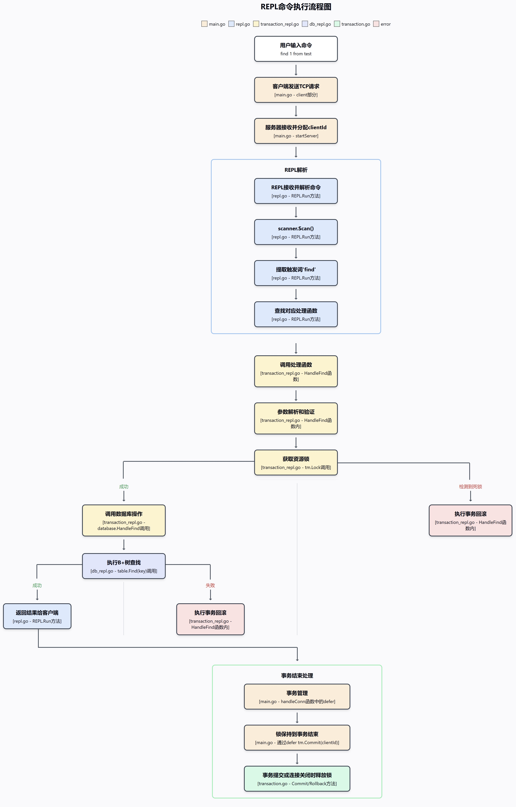

# Transaction

# 1. Important Concepts

## 1.1 Strict Two-Phase Locking (Strict 2PL) Protocol Working Principle

**1. Two Phases**:

- **Growing Phase**: Transactions can only acquire locks, cannot release any locks

- **Shrinking Phase**: Transactions can only release locks, cannot acquire new locks

**2. Strict Property**

- All locks must be held until the transaction ends (commit or abort)
- Unlike basic 2PL, strict 2PL does not allow early release of any locks during the transaction

**3. Lock Types**:

- **Read Lock (Shared Lock)**: Multiple transactions can simultaneously hold read locks on the same resource
- **Write Lock (Exclusive Lock)**: Can only be held by one transaction exclusively, mutually exclusive with any other lock

**4. Lock Operations**:

- **Acquire Lock**: Transaction attempts to acquire a resource lock; if the resource is already locked and incompatible, it waits
- **Detect Deadlock**: Identify potential deadlock situations through a wait-for graph
- **Rollback**: When a deadlock is detected, choose the current transaction to roll back, releasing all locks it holds

## 1.2 Implementation of Strict Two-Phase Locking in LOCK API

1. In the transaction manager, the purpose of Lock is to place read or write locks on keys of specified database indexes. This method follows the strict 2PL protocol, ensuring isolation between transactions.
2. The implementation process is divided into several key steps: First, retrieve the corresponding transaction object through the client ID. Then check if the transaction already holds a lock on that resource - if it holds the same type of lock, return directly; if it tries to upgrade from a read lock to a write lock, this operation will be rejected because strict 2PL does not allow lock upgrades.
3. Next is conflict detection and deadlock prevention. We identify all transactions that conflict with the current lock request and add corresponding wait edges to the wait-for graph, tracking dependencies between transactions. Then use DFS or topological sorting algorithms to detect if cycles exist in the wait-for graph, and if deadlock is detected, roll back the current transaction.
4. If there is no deadlock, acquire the actual lock on the resource - for read locks, they can only be acquired when there are no write locks; for write locks, the resource needs to be completely free to acquire. If these requirements are not met, the current transaction will be blocked waiting. Finally, update the transaction's state, recording the locked resources it now holds.
5. This design satisfies the isolation requirements of transactions, conforming to the working principles of the two phases and strict properties.

## 1.3 How Strict 2PL Ensures ACID Properties

**1. Atomicity**:

- Transactions either completely commit or completely roll back
- When errors occur (such as deadlocks), the transaction manager performs rollback, releasing all locks

**2. Consistency**:

- Lock mechanism ensures transactions can only modify data in a consistent manner
- Resource-level lock protection ensures data transitions from one consistent state to another

**3. Isolation**:

- Strict 2PL provides serializable isolation level
- Interference between transactions is minimized; each transaction sees a consistent snapshot of the database
- Prevents dirty reads, non-repeatable reads, and phantom reads

**4. Durability**:

- After a transaction commits, locks are released, and changes are permanently saved
- Combined with logging mechanisms to ensure recovery to the correct state even if the system crashes

## 1.4 Strict Two-Phase Locking Protocol vs. Regular Two-Phase Locking Protocol: Key Differences

**1. Main Difference**:

- **Regular 2PL**: Locks can be released during transaction execution, as long as they follow the "acquire first, release later" principle
- **Strict 2PL**: All locks must be held until the transaction ends (commit or abort) before being released

**2. Cascading Rollback Problem in Regular 2PL**: When transaction A releases a lock on resource X, transaction B acquires the lock on X and modifies X, if transaction A fails to commit and needs to roll back:

1. A's modified data needs to be restored
2. B has read data that A has not committed (and will eventually roll back), creating a dependency
3. B must also roll back, even if B itself has no errors
4. If C depends on B, C also needs to roll back, forming a cascading effect

**3. How Strict 2PL Avoids Cascading Rollbacks**: Strict 2PL avoids cascading rollbacks by holding all locks until the transaction ends, ensuring other transactions cannot read or modify uncommitted data, thus preventing dependency relationships.

**4. Strict 2PL Lock Acquisition Diagram**


**5. Regular 2PL Lock Acquisition Diagram**


# 2. Core Fields

```go
type TransactionManager struct {
	resourceLockManager *ResourceLockManager       // Maps every resource to its corresponding mutex
	waitsForGraph       *WaitsForGraph             // Identifies deadlocks through cycle detection
	transactions        map[uuid.UUID]*Transaction // Identifies the Transaction for a particular client
	mtx                 sync.RWMutex               // concurrency control for transactions
}
```

## 2.1 ResourceLockManager

```go
type ResourceLockManager struct {
    locks map[Resource]*sync.RWMutex // Hash map, key is Resource, value is lock type
    mtx   sync.Mutex // Protects concurrent access to the locks map, is a mutex, with only locked and unlocked states
}
type Resource struct {
    tableName string  // Database table name
    key       int64   // Record's primary key value
}
```

- Function: Maintains the mapping relationship between resources and corresponding mutex locks

- Role: Provides read-write lock control for each database resource, ensuring concurrent safety
- Implementation: locks stores a hash map with Resource as key and lock as value. mtx is mutual exclusive, can only be held by one transaction at a time, transactions must wait for other transactions to release mtx before obtaining ResourceLockManager

- ResourceLockManager example:

```go
// Possible contents of ResourceLockManager
resourceLockManager = {
    locks: {
        Resource{tableName: "users", key: 1}: &sync.RWMutex{}, // Stores a pointer to a read-write lock object
        Resource{tableName: "orders", key: 100}: &sync.RWMutex{}, // Whether it's a read lock or write lock is recorded in Transaction
    },
    mtx: sync.Mutex{state: locked}  // Mutex: locked by the current transaction
}
```

- Example of acquiring mtx:

```go
// Transaction 1 acquires mtx lock first, Transaction 2 waits
Transaction 1: Requesting write lock for users table id=1
    1.1 Acquire mtx lock           // mtx is locked by Transaction 1
    1.2 Find/create corresponding RWMutex in locks map
    1.3 Release mtx lock           // mtx is released

// Now Transaction 2 can acquire mtx
Transaction 2: Requesting write lock for orders table id=100
    2.1 Acquire mtx lock           // mtx is locked by Transaction 2
    2.2 Find/create corresponding RWMutex in locks map
    2.3 Release mtx lock           // mtx is released
```

## 2.2 WaitsForGraph

```go
// Wait-for graph, used to detect deadlocks between transactions
type WaitsForGraph struct {
    edges []Edge           // Stores all waiting edges (waiting relationships between transactions)
    mtx   sync.RWMutex    // Protects concurrent access to edges
}

type Edge struct {
    from *Transaction    // Transaction waiting for a resource
    to   *Transaction    // Transaction holding the resource
}
```

- Function: Records transaction waiting relationships, used for deadlock detection

- Role: Identifies deadlocks by detecting cycles in the graph

- Implementation: edges is a slice of Edge structures, each Edge represents one transaction waiting for another transaction (similar to a dynamic array, List in Java), used to record waiting relationships between transactions

- WaitsForGraph example:

```go
waitsForGraph = {
    edges: [
        Edge{from: transaction1, to: transaction2},  // Transaction 1 waits for Transaction 2
        Edge{from: transaction2, to: transaction3},  // Transaction 2 waits for Transaction 3
        Edge{from: transaction3, to: transaction1},  // Transaction 3 waits for Transaction 1, forming a cycle, indicating deadlock
    ],
    mtx: sync.RWMutex{} 
}
```

- Deadlock detection example:

```go
// 1. Transaction A requests resource X (held by Transaction B)
AddEdge(Transaction A, Transaction B)    // Add waiting edge: A -> B

// 2. Transaction B requests resource Y (held by Transaction A)
AddEdge(Transaction B, Transaction A)    // Add waiting edge: B -> A
                                       // Now forms a cycle A -> B -> A
                                       // DetectCycle() returns true, indicating deadlock detected
```

## 2.3 transactions

```go
// Transaction hash map
transactions map[uuid.UUID]*Transaction

type Transaction struct {
    clientId        uuid.UUID                  // Client ID
    lockedResources map[Resource]LockType      // Resource locks held by the current transaction
    mtx             sync.RWMutex               // Protects transaction internal state
}
```

- Function: Maintains all active transactions
- Role: Tracks transactions currently being executed by each client
- Implementation: Hash map using client ID as key and transaction object as value

- transactions example:

```go
transactions = {
    "client-uuid-1": &Transaction{
        clientId: "client-uuid-1",
        lockedResources: {
            Resource{"users", 1}: W_LOCK,     // Holds write lock on users table id=1, lock type is recorded here
            Resource{"orders", 100}: R_LOCK,  // Holds read lock on orders table id=100
        }
    },
    "client-uuid-2": &Transaction{
        clientId: "client-uuid-2",
        lockedResources: {
            Resource{"products", 50}: W_LOCK  // Holds write lock on products table id=50
        }
    }
}
```

- Transaction operation example

```go
// Begin new transaction
Begin("client-uuid-1"):
    1.1 Check if client already has an active transaction
    1.2 Create new Transaction object
    1.3 Add to transactions map

// Commit transaction
Commit("client-uuid-1"):
    1.1 Get the client's Transaction object
    1.2 Release all held resource locks
    1.3 Remove transaction from transactions hash map
```

## 2.4 sync.RWMutex

- Function: Read-write lock specifically protects concurrent access to the transactions map above
- Note: **Each hash map has its own dedicated lock to protect concurrent access, which is a common concurrent safety design pattern in Go.** The previous lockedResources hash map, edges hash map, locks hash map all use this pattern to control concurrency

# 3. Core Functions

## 3.1 Begin

### A. Parameter Introduction

```go
func (tm *TransactionManager) Begin(clientId uuid.UUID) error
```

- Parameters: clientId - Unique identifier for the client
- Returns: error - Returns an error if a transaction already exists, otherwise returns nil
- Purpose: Create and start a new transaction for the specified client

### B. Complete Flow

**1. Concurrency Control**

- First add a write lock to the transactions hash map
- Use defer to ensure the lock is always released

**2. Check Transaction Existence**

- Check if there's an existing transaction based on the client id. Note that a client can only have one active transaction at a time.

**3. Create New Transaction**

- If no transaction exists for the current client id, create a new transaction key-value pair in the transactions map, with the client id as the key and an initialized Transaction structure as the value.

**4. Return Value**

- If transaction exists, return `"transaction already began"`
- If creation is successful, return nil

## 3.2 Lock

```go
func (tm *TransactionManager) Lock(clientId uuid.UUID, table database.Index, resourceKey int64, lType LockType) error
```

### A. Parameter Introduction

- Parameters:
  - clientId - Unique identifier for the client
  - table - Database index
  - resourceKey - Key of the database index to be locked
  - lType - Lock type

- Returns: err - Returns an error if transaction not found, transaction holds resource upgrading lock, deadlock detected, or acquiring resource lock fails; otherwise returns nil
- Purpose: Place a read or write lock on a key in the specified database index.

### B. Complete Flow

**1. Get Transaction**

- First add a read lock to the transactions hash map. This read lock will be released if no transaction is found, transaction attempting to upgrade lock is detected, or deadlock is detected.

- Get the transaction based on client id, return an error if not found

- Find the transaction for the current client from the transactions hash map, create a new transaction object `t`

  `t, found := tm.GetTransaction(clientId)`

**2. Construct Resource Identifier**

- Build a Resource structure based on the database table and key

**3. Check if Lock is Held**

- Add a read lock to the current transaction `t`, this lock is released after this check

- If the current client already holds a read lock, according to strict 2PL constraints, the lock cannot be upgraded during transaction execution
- If the current client already holds the same type of lock, no need to lock again, return nil directly

**4. Detect Conflicting Transactions**

- Call `tm.conflictingTransactions(resource, lType)`, returns all transactions that conflict with the specified resource, conflict situations include:
  - A transaction holds a write lock on the resource
  - A transaction holds a read lock on the resource, while the current request is for a write lock

- Iterate through all conflicting transactions, call `tm.waitsForGraph.AddEdge(t, conflictingTxn)` to add a waiting edge to the waitsForGraph's edges slice, waitsForGraph example:

```go
waitsForGraph = {
    edges: [
        Edge{from: transaction1, to: transaction2},
        Edge{from: transaction2, to: transaction3},
        Edge{from: transaction3, to: transaction1}  // Forms a cycle
    ]
}
    T1[Transaction 1] --> T2[Transaction 2]
    T2[Transaction 2] --> T3[Transaction 3]
    T3[Transaction 3] --> T1[Transaction 1]
```

- When adding waiting edges, `defer tm.waitsForGraph.RemoveEdge(t, conflictingTxn)` is used, ensuring that waiting edges will be removed regardless of whether subsequent operations succeed.

**5. Deadlock Detection**

- Call `tm.waitsForGraph.DetectCycle()`
  - Use DFS to detect deadlocks for transactions with waiting cycles.
- Once a waiting cycle is found between the current transaction and other transactions, call `tm.Rollback(clientId)` to roll back the current transaction, release all locks held by the current transaction, and remove the current transaction from the transaction manager.

**6. Acquire Resource Lock**

- Release the read lock on the transactions hash map, at this point access to the transactions hash map has been completed.
- Call `tm.resourceLockManager.Lock(resource, lType)` to lock the resource.
  - First use a mutex to lock the locks map, ensuring thread safety. Look up the lock corresponding to the resource in the locks map, if it doesn't exist, create a new read-write lock. Finally release the locks map
  - Add read or write lock to the resource to be accessed:
    - For adding read lock (R_LOCK): Will wait if there's a write lock
    - For adding write lock (W_LOCK): Will wait if there's any lock

**7. Update Transaction State**

- Lock the hash map of lockedResources locked resources for the current transaction, use defer to unlock later
- Update the locked resource and lock type in the current transaction's `t.lockedResources` hash map

**8. Return Value**

- Transaction not found: `"transaction not found"`
- Attempting to upgrade lock: `"cannot upgrade from read lock to write lock in the middle of transaction"`
- Deadlock detected: `"deadlock detected"`
- Failed to acquire resource lock: Error from `resourceLockManager.Lock()`

## 3.3 Unlock

```go
func (tm *TransactionManager) Unlock(clientId uuid.UUID, table database.Index, resourceKey int64, lType LockType)
```

### **A. Parameter Introduction**

- Parameters:
  - clientId - Unique identifier for the client
  - table - Database index
  - resourceKey - Key of the database index to be unlocked
  - lType - Unlock type
- Returns: err - Returns an error if transaction not found, transaction doesn't hold the lock, unlock type doesn't match the held lock type, or releasing resource lock fails; otherwise returns nil
- Purpose: Release a read or write lock on a key in the specified database index
- Note: No blocking occurs during the unlock process, as unlocking itself is non-blocking and doesn't require any waiting conditions.

### **B. Complete Flow** 

**1. Get Transaction**

- First add a read lock to the transactions hash map, release the read lock after getting the transaction

- Get the transaction based on client id, return an error if not found

- Find the transaction for the current client from transactions, create a new transaction object `t`

  `t, found := tm.GetTransaction(clientId)`

**2. Construct Resource Identifier**

- Build a Resource structure `r` based on the database table and key

**3. Check if Transaction Holds Lock on Resource**

- Add a write lock to the current transaction `t`, use defer to ensure subsequent unlocking

- Check if the lock for the resource exists in the transaction object `t`'s lockedResources table, return an error if it doesn't exist

**4. Check if Lock Type Matches**

- If the requested unlock type doesn't match the lock type on the resource, the unlock cannot be completed
  - For example, if the resource itself is held by the transaction's write lock, and the requested unlock is a read lock, this operation cannot be completed

**5. Delete Lock and Release Lock in Resource Manager**

- Call `delete(t.lockedResources, resource)` to delete the resource and its corresponding lock from the transaction's lockedResources hash map
- Call `tm.resourceLockManager.Unlock(r, lType)`
  - First use a mutex to lock the locks map, ensuring thread safety.
  - If the resource doesn't exist, return an error
  - Call RUnlock() or Unlock() to release the corresponding type of lock based on the lock type

**6. Return Value**

- Transaction not found: `"transaction not found"`
- Transaction doesn't hold the lock: `"trying to unlock a resource that was not locked"`
- Lock type mismatch: `"incorrect unlock type"`
- Failed to release resource lock: Error from `resourceLockManager.Unlock()`

## 3.4 Commit

```go
func (tm *TransactionManager) Commit(clientId uuid.UUID)
```

### **A. Parameter Introduction**

- Parameters:
  - clientId - Unique identifier for the client
- Returns: err - Returns an error if transaction not found or releasing resource lock fails; otherwise returns nil
- Purpose: Commit the transaction, release all locks held by the transaction, and remove the transaction from the transaction manager

### B. Complete Flow

**1. Get Transaction**

- Add a write lock to the transactions hash map, use defer to ensure subsequent unlocking
- Get the transaction based on client id, return an error if not found
- Find the transaction object `t` for the current client from transactions

**2. Release Locks in Resource Manager**

- Call `tm.resourceLockManager.Unlock(r, lType)`
  - First use a mutex to lock the locks map, ensuring thread safety
  - If the resource doesn't exist, return an error
  - Call RUnlock() or Unlock() to release the corresponding type of lock based on the lock type

**3. Delete Transaction**

- Delete the transaction from the transaction manager's transactions hash map `delete(tm.transactions, clientId)`

- Since a write lock has already been added to the transactions hash map, this delete operation is thread-safe

**4. Return Value**

- Transaction not found: `"no transaction running for specified client"`

- Failed to release resource lock: Error from `resourceLockManager.Unlock()`

- Commit successful: Return nil

## 3.5 Rollback

### **A. Parameter Introduction**

- Parameters:
  - clientId - Unique identifier for the client
- Returns: err - Returns an error if transaction not found or releasing resource lock fails; otherwise returns nil
- Purpose: Roll back the transaction, release all locks held by the transaction, and remove the transaction from the transaction manager (similar to Commit, but semantically indicates transaction failure)

### **B. Complete Flow**

**1. Get Transaction**

- Add a write lock to the transactions hash map, use defer to ensure subsequent unlocking
- Get the transaction based on client id, return an error if not found
- Find the transaction object `t` for the current client from transactions

**2. Release Locks in Resource Manager**

- Add a read lock to the transaction object `t` to safely access lockedResources, release the read lock after this step
- Iterate through the transaction's lockedResources hash map, release the lock for each resource:
  - Call `tm.resourceLockManager.Unlock(r, lType)` for each resource, same as step 2 in `Commit`
  - If releasing a resource lock fails, return an error immediately

**3. Remove Transaction**

- Delete the transaction from the transaction manager's transactions hash map `delete(tm.transactions, clientId)`
- Since a write lock on transactions is already held, this operation is thread-safe

**4. Return Value**

- Transaction not found: `"no transaction running for specified client"`
- Failed to release resource lock: Error from `resourceLockManager.Unlock()`
- Rollback successful: Return nil

# 4. Testing

## 4.1 Testing Framework

```go
Test code                      handleTransactionThread
   |                                |
   |-- Create channel ch1 --------> |
   |                                |
   |-- sendWithDelay             Wait for command (<-ch)
   |     |                           |
   |     |-Delay                     |
   |     |-Send command----------> Execute command
   |                                 |
   |                                 |
   |                                 |
   |-- sendWithDelay ------------->Wait for next command
```

## 4.2 Basic Functionality Tests

- `testTransactionBasic`: Test basic write lock acquisition
- `testTransactionWriteUnlock`: Test write lock locking and unlocking
- `testTransactionReadUnlock`: Test read lock locking and unlocking
- `testTransactionCommitsReleaseLocks`: Test releasing all locks when committing

## 4.3 Lock Types and Compatibility Tests

- `testTransactionReadLockNoCycle`: Test multiple read locks coexistence
- `testTransactionDontUpgradeLocks`: Test prohibition of upgrading read locks to write locks
- `testTransactionDontDowngradeLocks`: Test lock downgrade scenarios
- `testTransactionLockIdempotency`: Test idempotency of repeated locking

## 4.4 Error Handling Tests

- `testTransactionWrongUnlockLockType`: Test handling incorrect unlock types
- `testTransactionDeadlock`: Test deadlock detection and handling

## 4.5 Concurrent Scenario Tests

- `testTransactionDAGNoCycle`: Test directed acyclic graph concurrent scenarios
- `testTransactionDeadlock`: Test deadlock concurrent scenarios

## 4.6 Complete Transaction Flow Tests

`TestCompleteTransaction`: Test complete transaction lifecycle

- Scenario 1: Normal execution and commit
- Scenario 2: Lock upgrade failure and rollback
- Scenario 3: New transaction acquiring resources from a rolled back transaction

## 4.7 Stress Tests

`TestStress`: System stability tests under high concurrency

- Purpose: Test system performance and stability under high load
- Implementation:
  - Start 100 concurrent goroutines, each executing 1000 transaction operations
  - 100 resources
  - Each transaction randomly executes multiple read and write operations
  - Add random delays to simulate real scenarios
- Test points:
  - Concurrent transaction processing capability
  - Deadlock detection and handling
  - Error recovery mechanism
  - System stability

## 4.8 Resource Usage Tests

`TestResourceUsage`: System resource consumption monitoring tests

- Purpose: Monitor system resource usage under a large number of operations
- Implementation:
  - Serially execute 10000 transaction operations on one client
  - Each transaction executes a complete lock-unlock-commit flow
- Test points:
  - Memory usage (only 16.5KB memory overhead produced)
  - Resource release correctness (each transaction correctly releases resources after ending)
  - Memory leak detection (memory growth stabilizes after multiple GCs)

- Performance metrics:

  - Average memory overhead of about 1.65 bytes per transaction, very efficient memory management compared to MySQL which needs a few KB to tens of KB per transaction

  - About 3800 transaction operations per second in serial processing

  - Memory usage grows linearly with the number of transactions, no leaks

## 4.9 REPL Command Execution Flow



# 5. Existing Issues

## 5.1 Deadlock Issues in Stress Testing

### A. Problem Manifestation

In stress testing, when multiple transactions execute concurrently, situations occur where resources are locked but cannot be released. Specifically:

- Multiple transactions simultaneously request write locks for the same resource
- After the first transaction acquires the lock, other transactions keep waiting
- Unlock operations were actually called, but no logs of any unlock operations were seen, the system eventually falls into a deadlock state

### B. Problem Analysis

- Lock request accumulation

  - Many transactions request the same resource simultaneously

  - Subsequent transactions continue to wait, forming a request queue

  - Possibly caused by the concentration of random number generation

- Unlock mechanism failure

  - After resource locks are successfully acquired, release operations are not correctly executed

  - The deadlock detection algorithm (dfs function) has flaws in implementation, unable to correctly identify circular waiting

- Solution difficulties:

  - Attempt to record operation logs, but the order of log printing may not accurately reflect the actual order of code execution, because:

    - Log printing delay: Logging itself has overhead, especially when writing to a terminal or file

    - Thread scheduling: Thread scheduling in a multi-threaded environment is unpredictable

    - Concurrent operations: Multiple operations may occur simultaneously at very close time points

```
=== RUN   TestStress
=== PAUSE TestStress
=== CONT  TestStress
=== Transaction[c69bf968] requests write lock for resource[3002996722.db.1] ===
✅ Found transaction[c69bf968]
📦 Construct resource identifier: 3002996722.db.1
✅ Transaction[c69bf968] successfully acquired write lock for resource[3002996722.db.1]
✅ Update lock record for transaction[c69bf968]
=== Transaction[c69bf968] requests to release write lock for resource[3002996722.db.1] ===
=== Transaction[fc1e9f98] requests write lock for resource[3002996722.db.1] ===
=== Transaction[c312fc49] requests write lock for resource[3002996722.db.1] ===
=== Transaction[cfdfa504] requests read lock for resource[3002996722.db.1] ===
```

### C. Modification Plan

- Use topological sorting instead of dfs for deadlock detection, topological sorting avoids the recursive calls and backtracking of DFS, reducing stack space usage

- Modify the logic of `tm.resourceLockManager.Unlock(r, lType)`